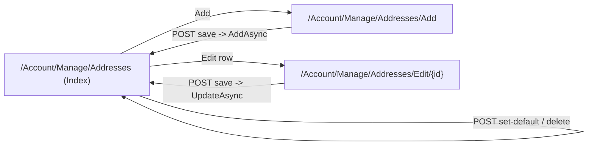

# Phase 3 - Address book UI

Adds the customer UI for managing saved addresses, consuming the `IAddressService` from Phase 2. No checkout wiring (Phase 4).

## Architecture constraint (decisive)
All `Account` pages are static server-side rendered: [Components/Account/Pages/_Imports.razor](Components/Account/Pages/_Imports.razor) applies `@attribute [ExcludeFromInteractiveRouting]`, and [Components/Account/Pages/Manage/_Imports.razor](Components/Account/Pages/Manage/_Imports.razor) applies `@layout ManageLayout` + `[Authorize]` (both cascade into a new `Manage/Addresses/` subfolder). So the address book uses the Identity Manage pattern, NOT interactivity:
- Current user via `[CascadingParameter] HttpContext` + `UserManager.GetUserAsync(HttpContext.User)`; redirect with `IdentityRedirectManager` when null. Pass `user.Id` to `IAddressService`.
- Forms are `EditForm` / `<form method="post">` with `@formname` + `<AntiforgeryToken />`; handlers run on POST (`OnValidSubmit` / `@onsubmit`). Reference multi-form page: [Components/Account/Pages/Manage/Email.razor](Components/Account/Pages/Manage/Email.razor).
- Status feedback via `<StatusMessage />` + `RedirectManager.RedirectToCurrentPageWithStatus(...)`.
- Tailwind styling consistent with [Components/Account/Pages/Login.razor](Components/Account/Pages/Login.razor) (`InputBaseClass`, `GetInputClass`) and [Components/Account/Shared/StatusMessage.razor](Components/Account/Shared/StatusMessage.razor).



## 1. Service addition - `GetByIdAsync`
The edit page needs to load one owned address to prefill. Add to [Services/Addresses/IAddressService.cs](Services/Addresses/IAddressService.cs) and [Services/Addresses/AddressService.cs](Services/Addresses/AddressService.cs):

```csharp
Task<AddressDto?> GetByIdAsync(string userId, int addressId, CancellationToken cancellationToken = default);
```

Implementation mirrors `GetDefaultAsync`: `AsNoTracking().FirstOrDefaultAsync(a => a.Id == addressId && a.UserId == userId)`, map or null (per-user scoped). Add a matching test in [AddressServiceTests.cs](Nexus.Test.Integration/Features/Addresses/AddressServiceTests.cs) (returns own, null for foreign user).

## 2. One-line formatter - `Services/Addresses/AddressFormatter.cs`
Static helper used by the list/cards (roadmap 3.4). Composes `"{AddressLine}, {Ward}, {Province}"`, appending `Country` only when it is not "Vietnam":

```csharp
namespace Nexus.Services.Addresses;

public static class AddressFormatter
{
    public static string OneLine(AddressDto a)
    {
        var parts = new List<string> { a.AddressLine, a.Ward, a.Province };
        if (!string.Equals(a.Country, "Vietnam", StringComparison.OrdinalIgnoreCase)
            && !string.IsNullOrWhiteSpace(a.Country))
            parts.Add(a.Country);
        return string.Join(", ", parts.Where(p => !string.IsNullOrWhiteSpace(p)));
    }
}
```

## 3. List page - `Components/Account/Pages/Manage/Addresses/Index.razor`
Route `@page "/Account/Manage/Addresses"`. Injects `UserManager<ApplicationUser>`, `IAddressService`, `IdentityRedirectManager`.
- `OnInitializedAsync`: resolve user from `HttpContext`; if null `RedirectManager.RedirectToInvalidUser(...)`. Load `addresses = await AddressService.GetAddressesAsync(user.Id)`.
- Header with title + an "Add address" link to `/Account/Manage/Addresses/Add`. `<StatusMessage />` at top.
- Empty state when no addresses.
- One card per address: recipient, phone, `AddressFormatter.OneLine(a)`, optional `Label`, and a "Default" badge when `a.IsDefault`. Per-row actions:
  - Edit: link to `@($"/Account/Manage/Addresses/Edit/{a.Id}")`.
  - Set as default (only when not default): a `<form method="post" @formname="@($"set-default-{a.Id}")" @onsubmit="() => SetDefaultAsync(a.Id)">` with `<AntiforgeryToken />` and a submit button.
  - Delete: a `<form method="post" @formname="@($"delete-{a.Id}")" @onsubmit="() => DeleteAsync(a.Id)">` with `<AntiforgeryToken />` and a submit button.
- Handlers call the service (`SetDefaultAsync` / `DeleteAsync`) with `user.Id`, then `RedirectManager.RedirectToCurrentPageWithStatus("...", HttpContext)` on success or set an inline error message on failure. Unique `@formname` per row is required by static SSR.

## 4. Add/Edit page - `Components/Account/Pages/Manage/Addresses/Edit.razor`
Two routes on one component:
```razor
@page "/Account/Manage/Addresses/Add"
@page "/Account/Manage/Addresses/Edit/{AddressId:int}"
```
`[Parameter] public int? AddressId { get; set; }` (set only on the Edit route). Injects `UserManager`, `IAddressService`, `IdentityRedirectManager`.
- `[SupplyParameterFromForm] InputModel Input`; `[CascadingParameter] HttpContext`.
- `OnInitializedAsync`: `Input ??= new()`; resolve user (redirect if null). If `AddressId is int id` and this is the initial GET (`HttpMethods.IsGet(HttpContext.Request.Method)`), load via `GetByIdAsync(user.Id, id)`; if null -> redirect to list with an error status; else prefill `Input` from the DTO.
- `EditForm Model="Input" FormName="address" OnValidSubmit="OnValidSubmitAsync" method="post"` with `DataAnnotationsValidator`, styled `InputText` fields for RecipientName, Phone, AddressLine, Ward, Province, optional Label, and an `InputCheckbox` for `SetAsDefault`. Country stays "Vietnam" (hidden/defaulted, not shown). VN-native labels: "Recipient name", "Phone number", "Street address / detail", "Ward / Commune", "Province / City".
- `OnValidSubmitAsync`: build `AddressInput` from `Input`; call `UpdateAsync(user.Id, AddressId.Value, input)` when editing else `AddAsync(user.Id, input)`. On success `RedirectManager.RedirectTo("Account/Manage/Addresses")` (optionally with status); on failure set inline error and re-render.
- `InputModel` (private) uses DataAnnotations: `[Required]` on RecipientName, Phone, AddressLine, Ward, Province; `[Display(Name=...)]`; `Label` optional; `SetAsDefault` bool. This complements the service-side validation.

## 5. Nav link - [Components/Account/Shared/ManageNavMenu.razor](Components/Account/Shared/ManageNavMenu.razor)
Add a `NavLink` (after Profile) to `Account/Manage/Addresses` with an icon, e.g.:
```razor
<NavLink class="manage-nav-link" href="Account/Manage/Addresses">
    <i class="fa-solid fa-location-dot w-4 text-center"></i><span>Addresses</span>
</NavLink>
```

## 6. Tests - `Nexus.Test.Integration/Features/Addresses/AddressPageTests.cs`
Mirror [OrderPageTests.cs](Nexus.Test.Integration/Features/Orders/OrderPageTests.cs): `IClassFixture<TestDatabaseFixture>`, `TestWebApplicationFactory`, HTTP GET via `CreateClient`. The default test identity (`TestAuthHandler.TestUserId`, seeded, authenticated) satisfies `[Authorize]`. Seed addresses by resolving `IAddressService` from `_factory.Services` for `TestAuthHandler.TestUserId`.
- `GetAddresses_Unauthenticated_RedirectsToLogin` (`X-Test-Anonymous: true` -> redirect containing `Account/Login`).
- `GetAddresses_Authenticated_ReturnsOk` -> 200; when a seeded address exists, HTML contains its recipient/`OneLine` and a "Default" indicator.
- `GetAddresses_Empty_ShowsEmptyState` -> 200 with the empty-state copy and an Add link.
- `GetAddEditPage_Authenticated_ReturnsOk` -> GET `/Account/Manage/Addresses/Add` returns 200 with the form; GET `/Account/Manage/Addresses/Edit/{id}` for a seeded address returns 200 prefilled.

(POST/CRUD behavior is already covered by `AddressServiceTests`; page tests focus on auth + rendering, matching the existing page-test convention.)

## Implementation guidelines
- Always bind C# expressions to attributes with `@`: `value="@x"`, `disabled="@flag"`, `href="@url"`, and directive attributes as `@formname="@(...)"`, `@bind-Value`, `@onsubmit`.
- Keep unique `@formname` per rendered form (required in static SSR).
- Reuse `StatusMessage`, `IdentityRedirectManager`, and the Login page's Tailwind input styling for a consistent look.

## Acceptance criteria
- Signed-out users are redirected to login for the address pages.
- A customer can view their addresses (default shown first, badged), add, edit, set default, and delete; each action returns to the list with a status message.
- The single-default invariant holds through the UI (delegated to `IAddressService`).
- `dotnet build` (main + test) succeeds; new page tests and the `GetByIdAsync` service test pass.

## Out of scope (Phase 4)
- Checkout prefill, saved-address picker, VN relabel of the checkout form, and `Ship*` mapping.
- Province/ward dropdown datasets (optional Phase 5).