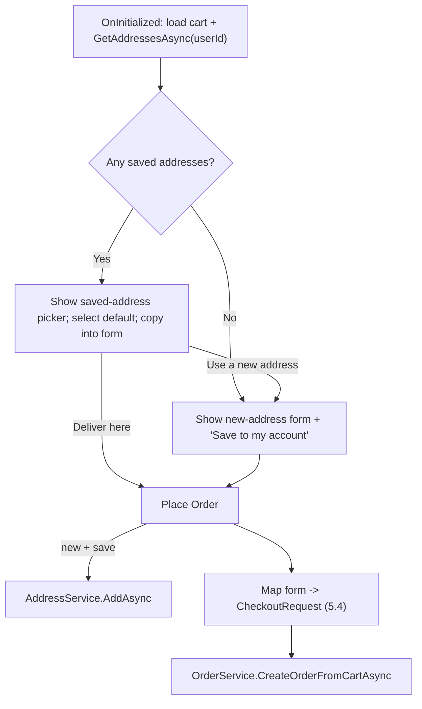

# Phase 4 - Checkout integration

Connects the Phase 2/3 address book to checkout. No schema or service-contract changes: VN fields map onto the existing `Order.Ship*` columns via `CheckoutRequest` (roadmap 5.4), so [Services/Orders/OrderService.cs](Services/Orders/OrderService.cs) and [Services/Orders/Models/CheckoutRequest.cs](Services/Orders/Models/CheckoutRequest.cs) are unchanged.

## Context confirmed
- [Components/Pages/Checkout/Index.razor](Components/Pages/Checkout/Index.razor) is `@rendermode InteractiveServer` and gets `userId` from `AuthenticationStateProvider` - so it can inject `IAddressService` and do interactive picking/toggling. It prerenders on GET (existing `OrderPageTests` rely on this).
- `CheckoutRequest` keeps fields `ShipFullName/ShipPhone/ShipStreet/ShipCity/ShipState/ShipPostalCode/ShipCountry/Method/ReturnUrlBase`.
- Only test coupling to labels: [OrderPageTests.cs](Nexus.Test.Integration/Features/Orders/OrderPageTests.cs) line 51 asserts the page contains `"Shipping Address"` - keep that heading. Service-level tests seed `CheckoutRequest` directly and are unaffected.

## Field mapping (roadmap 5.4)
- RecipientName -> `ShipFullName`
- Phone -> `ShipPhone`
- AddressLine -> `ShipStreet`
- Ward -> `ShipState`
- Province -> `ShipCity`
- Country ("Vietnam") -> `ShipCountry`
- `ShipPostalCode` -> null (postal code dropped)

## Checkout flow


## 1. Checkout page - [Components/Pages/Checkout/Index.razor](Components/Pages/Checkout/Index.razor)
Add `@using Nexus.Services.Addresses` + `.Models` and `@inject IAddressService AddressService`.

Form model (replace `CheckoutFormModel` fields with VN-native, keeping `Method`):
```csharp
private sealed class CheckoutFormModel
{
    [Required(ErrorMessage = "Recipient name is required.")] public string RecipientName { get; set; } = string.Empty;
    [Required(ErrorMessage = "Phone is required.")] public string Phone { get; set; } = string.Empty;
    [Required(ErrorMessage = "Street address is required.")] public string AddressLine { get; set; } = string.Empty;
    [Required(ErrorMessage = "Ward / commune is required.")] public string Ward { get; set; } = string.Empty;
    [Required(ErrorMessage = "Province / city is required.")] public string Province { get; set; } = string.Empty;
    public string Country { get; set; } = "Vietnam";
    public PaymentMethod Method { get; set; } = PaymentMethod.Cod;
}
```

State: `IReadOnlyList<AddressDto> savedAddresses = []`, `int? selectedAddressId`, `bool useNewAddress`, `bool saveNewAddress = true`.

`OnInitializedAsync` (after cart load): `savedAddresses = await AddressService.GetAddressesAsync(userId)`. If any exist, select the default (or first), `useNewAddress = false`, and copy it into `form` via `ApplyAddress(dto)`; else `useNewAddress = true` and prefill `form.RecipientName` from `appUser.FullName` (keep existing behavior).

UI inside the "Shipping Address" card (keep that exact heading):
- When `savedAddresses.Any()`: render a radio per address (recipient + `AddressFormatter.OneLine(a)` + Default badge). Selecting calls `SelectAddress(a)` (`@onchange`), which sets `selectedAddressId`, `useNewAddress=false`, and copies fields into `form`. Add a "Use a new address" button that sets `useNewAddress=true` and clears `form` (keep profile name). When not `useNewAddress`, show the selected address read-only (no inputs).
- When `useNewAddress` (or no saved addresses): render VN-native `InputText` fields for RecipientName, Phone, AddressLine, Ward ("Ward / Commune"), Province ("Province / City") with `ValidationMessage`; Country stays "Vietnam" (not shown); plus an `InputCheckbox @bind-Value="saveNewAddress"` labeled "Save this address to my account".
- Because `form` is the `EditForm` model and is always populated (from the selected address or typed input), `DataAnnotationsValidator` passes whether or not the inputs are rendered.

`PlaceOrder`:
- If `useNewAddress && saveNewAddress`: `await AddressService.AddAsync(userId, new AddressInput { RecipientName=form.RecipientName, Phone=form.Phone, AddressLine=form.AddressLine, Ward=form.Ward, Province=form.Province, Country="Vietnam", SetAsDefault = savedAddresses.Count == 0 })` (surface failure via `errorMessage`, stop).
- Build `CheckoutRequest` with the 5.4 mapping (`ShipStreet=form.AddressLine`, `ShipState=form.Ward`, `ShipCity=form.Province`, `ShipCountry=form.Country`, `ShipPostalCode=null`), then call `OrderService.CreateOrderFromCartAsync` exactly as today (COD redirect + PayPal redirect unchanged).

Helper `ApplyAddress(AddressDto a)` copies dto -> `form`.

## 2. Order confirmation/detail - [Components/Pages/Orders/Detail.razor](Components/Pages/Orders/Detail.razor)
In the "Shipping Address" block, reorder to VN reading order and drop postal code:
- Line 1: `@order.ShipStreet` (detail line)
- Line 2: Ward + Province from `@order.ShipState` + `@order.ShipCity`, joined with ", " (guard nulls for legacy rows)
- Line 3: `@order.ShipCountry`

## 3. Admin order detail - [Components/Admin/Pages/Orders/Detail.razor](Components/Admin/Pages/Orders/Detail.razor)
Same reorder in the "Ship to" block (`ShipStreet`, then `ShipState, ShipCity`, then `ShipCountry`; drop postal code). Keep "Customer & Shipping" section title.

## 4. Tests - [Nexus.Test.Integration/Features/Orders/OrderPageTests.cs](Nexus.Test.Integration/Features/Orders/OrderPageTests.cs) (add) or a new `CheckoutAddressPageTests.cs`
Checkout prerenders on GET, so assert rendered HTML (seed via `IAddressService` for `TestAuthHandler.TestUserId`, add a cart item, GET `/checkout` with `X-Test-Roles: Customer`):
- `GetCheckout_WithDefaultAddress_ShowsSavedAddress` -> HTML contains the seeded recipient and `OneLine` parts (e.g., "Tan An", "Can Tho").
- `GetCheckout_NoSavedAddress_ShowsNewAddressForm` -> HTML contains "Ward / Commune", "Province / City", and the "Save this address" label.
- Keep the existing `GetCheckoutPage_*` tests green (heading "Shipping Address" retained).

Interactive selection/submission is not exercised over HTTP (no circuit in these tests); the address-save and mapping logic live in the component, and order creation remains covered by `OrderServiceTests`.

## Implementation guidelines
- Bind C# expressions to attributes with `@` (`@bind-Value`, `@onchange`, `checked="@(...)"`, `class="@InputClass"`, `disabled="@(...)"`).
- Keep the manual-entry path fully functional for users with no saved address (backward compatible with today's checkout).
- Reuse `AddressFormatter.OneLine` for summaries.

## Acceptance criteria
- A customer with a default address sees it preselected and can place an order without retyping.
- A customer can switch to another saved address or enter a new one; "Save this address" persists it (first one becomes default).
- Customers with no saved address can still check out via manual entry.
- The order snapshot (`Ship*`) matches the chosen/typed address; order and admin detail render the VN-ordered address.
- `dotnet build` (main + test) succeeds; new checkout render tests pass and existing order/admin/checkout tests stay green.

## Out of scope
- Province/ward dropdown datasets (optional Phase 5).