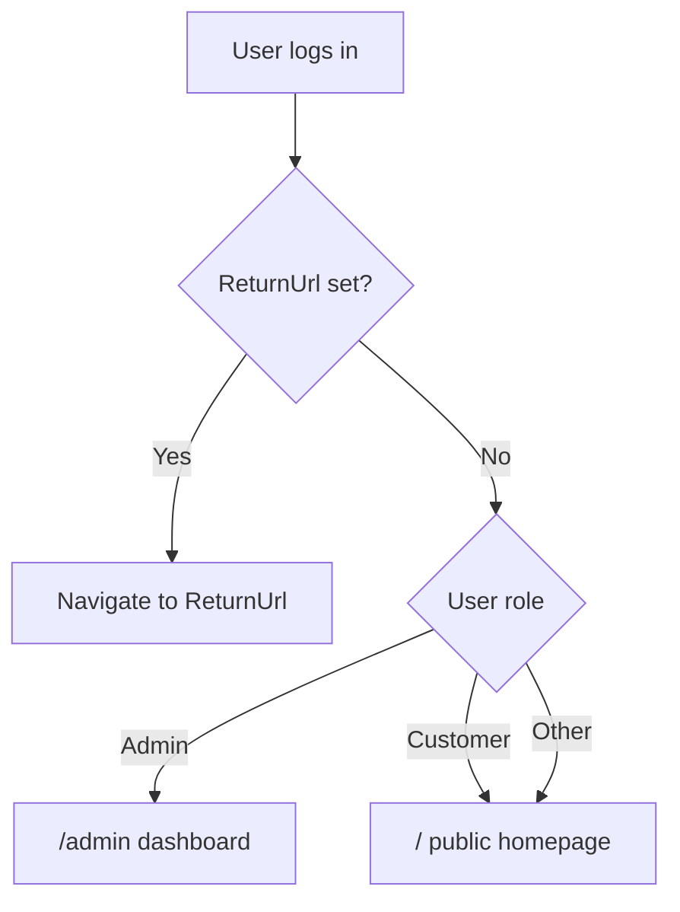

# Customer Homepage + Admin Dashboard + Role-Based Redirects

## Current state

| Area | Status |
|------|--------|
| [`Components/Pages/Home.razor`](Components/Pages/Home.razor) | Placeholder (`Hello, world!`) |
| `/admin` route | Missing — [`AdminNavMenu.razor`](Components/Admin/Layout/AdminNavMenu.razor) links to it but no page exists |
| Post-login redirect | All roles go to `ReturnUrl` or `/` — no role logic in [`Login.razor`](Components/Account/Pages/Login.razor) |
| Storefront layout | Missing — [`MainLayout.razor`](Components/Layout/MainLayout.razor) is a bare `@Body` wrapper |
| Design tokens | Ready in [`Styles/app.tailwind.css`](Styles/app.tailwind.css) (`bg-bg-base`, `text-text-primary`, etc.) |
| Catalog APIs | Admin-only `GetPagedAsync` on [`ICategoryService`](Services/Categories/ICategoryService.cs) / [`IProductService`](Services/Products/IProductService.cs) — sufficient for homepage sections |

## Target behavior



- **`/`** — Public storefront (confirmed). Guests and customers see the same page; customers are sent here after login when no `ReturnUrl`.
- **`/admin`** — Admin-only dashboard (existing `[Authorize(Roles = Admin)]` on admin pages).
- **English copy** throughout new UI (mockup `dashboard.html` is Vietnamese — translate during port).
- **Currency** — Use USD formatting (`$2,450.00`) for consistency with English UI; mockup VND values become illustrative USD amounts.

---

## Phase 1 — Storefront shell and homepage

Mirror the [`Components/Admin`](Components/Admin) area pattern with a new `Components/Storefront` area.

### New folder structure

```
Components/Storefront/
├── _Imports.razor
├── Layout/
│   ├── StorefrontLayout.razor    # announcement bar + header + footer wrapper
│   ├── SiteHeader.razor          # logo, nav, search, cart, account
│   └── SiteFooter.razor
└── Shared/
    ├── AnnouncementBar.razor
    ├── HeroSection.razor
    ├── CategoryGrid.razor
    ├── ProductCard.razor
    ├── ProductGrid.razor
    ├── PromoBanner.razor
    ├── FeaturesSection.razor
    └── NewsletterSection.razor
```

### Port sections from [`mockup/home-eng.html`](mockup/home-eng.html)

| Section | Component | Notes |
|---------|-----------|-------|
| Announcement bar | `AnnouncementBar` | Static promo copy |
| Sticky header | `SiteHeader` | Nav links are placeholders (`#` or future `/products`); account icon links to `/Account/Login` or `/Account/Manage` when authenticated |
| Hero | `HeroSection` | Gradient headline, CTA buttons, hero image (Unsplash URL from mockup) |
| Trending categories | `CategoryGrid` | **Live data** via `ICategoryService.GetPagedAsync` (Active, top 4) |
| Hottest products | `ProductGrid` | **Live data** via `IProductService.GetPagedAsync` (Active, top 8); reuse `ProductCard` |
| Promo banner | `PromoBanner` | Static flash-sale block with countdown placeholders |
| Trust features | `FeaturesSection` | 3-column icons |
| Newsletter | `NewsletterSection` | Client-side form stub (no backend yet) |
| Footer | `SiteFooter` | 4-column links |

### Token mapping (mockup → Blazor)

| Mockup class | Blazor equivalent |
|--------------|-------------------|
| `bg-nexus-base` | `bg-bg-base` |
| `bg-nexus-surface` | `bg-bg-surface` |
| `text-nexus-secondary` | `text-text-secondary` |
| `bg-accent-gradient` | `bg-gradient-to-r from-indigo-500 to-purple-500` |
| `text-nexus-cyan` | `text-cyber-cyan` |

### CSS additions in [`Styles/app.tailwind.css`](Styles/app.tailwind.css)

Add storefront utilities not yet in the compiled CSS:

- `@keyframes float` / `@keyframes blobby` + `.animate-float` / `.animate-blobby`
- `.hero-glow::before/::after` pseudo-element glows
- `.promo-glow::after`
- `.backdrop-blur-20` / `.backdrop-blur-8` (if not covered by Tailwind defaults)

### Update [`Components/Pages/Home.razor`](Components/Pages/Home.razor)

```razor
@page "/"
@layout StorefrontLayout
@rendermode InteractiveServer

@inject ICategoryService CategoryService
@inject IProductService ProductService

<PageTitle>NEXUS // Premium E-Commerce</PageTitle>

<HeroSection />
<CategoryGrid Categories="categories" />
<ProductGrid Products="products" />
<PromoBanner />
<FeaturesSection />
<NewsletterSection />
```

Load active categories/products in `OnInitializedAsync`. Empty DB → show friendly empty state (not mock cards).

### Wire imports

Add to [`Components/_Imports.razor`](Components/_Imports.razor):

```razor
@using Nexus.Components.Storefront.Layout
@using Nexus.Components.Storefront.Shared
```

---

## Phase 2 — Admin dashboard at `/admin`

Create [`Components/Admin/Pages/Dashboard/Index.razor`](Components/Admin/Pages/Dashboard/Index.razor):

```razor
@page "/admin"
@rendermode InteractiveServer
```

Uses existing [`AdminLayout`](Components/Admin/Layout/AdminLayout.razor) via admin `_Imports.razor`. Set `CascadingValue Name="AdminPageTitle"` → `"Dashboard Overview"`.

### Port from [`mockup/dashboard.html`](mockup/dashboard.html) (English)

Extract into shared components under `Components/Admin/Shared/`:

| Component | Content |
|-----------|---------|
| `DashboardKpiRow.razor` | 4 KPI cards (Revenue, Orders, New Customers, Conversion) |
| `DashboardRevenueChart.razor` | CSS bar chart (7-day static data) |
| `DashboardTopProducts.razor` | Progress-bar product list |
| `DashboardRecentOrders.razor` | Table with status badges |

**Data strategy:** Static placeholder values (no orders/revenue service exists). Structure components to accept parameters so live data can replace placeholders later.

**Styling:** Use Tailwind utility classes matching existing admin pages (`bg-bg-surface`, `border-white/5`, `text-success`, etc.) — same approach as [`AdminLayout.razor`](Components/Admin/Layout/AdminLayout.razor), not raw CSS variables from the mockup.

[`AdminNavMenu.razor`](Components/Admin/Layout/AdminNavMenu.razor) already links `/admin` with `Match="NavLinkMatch.All"` — no nav changes needed.

---

## Phase 3 — Role-based post-login redirects

### New helper: `Services/Auth/RoleLandingHelper.cs`

```csharp
public static class RoleLandingHelper
{
    public const string AdminDashboard = "/admin";
    public const string CustomerHome = "/";

    public static string GetDefaultLandingPath(ClaimsPrincipal user) =>
        user.IsInRole(IdentitySeedData.AdminRole) ? AdminDashboard : CustomerHome;

    public static string ResolveReturnUrl(string? returnUrl, ClaimsPrincipal user) =>
        string.IsNullOrWhiteSpace(returnUrl) ? GetDefaultLandingPath(user) : returnUrl;
}
```

### Update login success handlers

Replace bare `RedirectManager.RedirectTo(ReturnUrl)` with role-aware resolution in:

- [`Components/Account/Pages/Login.razor`](Components/Account/Pages/Login.razor)
- [`Components/Account/Pages/Register.razor`](Components/Account/Pages/Register.razor)
- [`Components/Account/Pages/LoginWith2fa.razor`](Components/Account/Pages/LoginWith2fa.razor)
- [`Components/Account/Pages/LoginWithRecoveryCode.razor`](Components/Account/Pages/LoginWithRecoveryCode.razor)
- [`Components/Account/Pages/ExternalLogin.razor`](Components/Account/Pages/ExternalLogin.razor)

Pattern after successful sign-in:

```csharp
var authState = await AuthenticationStateProvider.GetAuthenticationStateAsync();
RedirectManager.RedirectTo(RoleLandingHelper.ResolveReturnUrl(ReturnUrl, authState.User));
```

When `ReturnUrl` is explicitly set (e.g. user tried to access a protected page), honor it — do not override with role default.

### Optional UX improvement (recommended, small scope)

Update [`Components/Routes.razor`](Components/Routes.razor) `NotAuthorized` to distinguish authenticated vs unauthenticated:

- Not authenticated → `RedirectToLogin` (current)
- Authenticated, wrong role → navigate to `/Account/AccessDenied`

---

## Phase 4 — Tests

### Update [`Nexus.Test.Integration/Features/Home/HomePageTests.cs`](Nexus.Test.Integration/Features/Home/HomePageTests.cs)

- Assert response contains key English strings (`NEXUS`, `Trending Categories`, `Hottest Products`)

### New `Nexus.Test.Integration/Features/Auth/RoleLandingTests.cs`

| Test | Expectation |
|------|-------------|
| Admin login, no ReturnUrl | Redirects to `/admin` |
| Customer login, no ReturnUrl | Redirects to `/` |
| Login with explicit ReturnUrl | Honors ReturnUrl |
| Customer cannot access `/admin` | 401/redirect to login or access denied |
| Admin can access `/admin` | 200 OK |

Reuse existing test helpers from [`Nexus.Test.Integration/Infrastructure/`](Nexus.Test.Integration/Infrastructure/) (factory, DbHelper, seeded admin credentials).

### New `Nexus.Test.Integration/Features/Admin/AdminDashboardPageTests.cs`

- Admin GET `/admin` → 200
- Unauthenticated GET `/admin` → redirect to login

---

## Out of scope (defer to Phase 4 roadmap)

- `/products`, `/products/{slug}` catalog pages
- Cart, wishlist, checkout functionality
- Live dashboard KPIs / order tables
- Newsletter backend
- Translating existing Vietnamese auth pages ([`Login.razor`](Components/Account/Pages/Login.razor)) — separate cleanup task

---

## Implementation order

1. Tailwind utilities + `StorefrontLayout` shell
2. Section components + `Home.razor` with live category/product data
3. Admin dashboard page + shared dashboard components
4. `RoleLandingHelper` + login flow updates
5. Integration tests

## Key files to touch

| Action | File |
|--------|------|
| Replace | [`Components/Pages/Home.razor`](Components/Pages/Home.razor) |
| Create | `Components/Storefront/**` (~10 files) |
| Create | `Components/Admin/Pages/Dashboard/Index.razor` + 4 dashboard shared components |
| Create | `Services/Auth/RoleLandingHelper.cs` |
| Modify | 5 Account login/register pages |
| Modify | [`Styles/app.tailwind.css`](Styles/app.tailwind.css) |
| Modify | [`Components/_Imports.razor`](Components/_Imports.razor) |
| Optional | [`Components/Routes.razor`](Components/Routes.razor) |
| Tests | Home, Auth redirect, Admin dashboard
