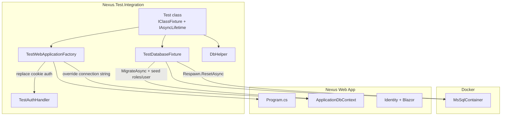

# Nexus Integration Test Project Plan

## Goal

Create [`Nexus.Test.Integration`](d:\DevZone\Nexus\Nexus.Test.Integration) as an integration test project modeled on [`Testify.Test.Integration`](D:\DevZone\TestifyDev\Testify.Test.Integration), adapted for Nexus's current stack: **ASP.NET Core 10 Blazor Server**, **EF Core + SQL Server**, and **ASP.NET Core Identity** (no MassTransit, MinIO, or REST APIs yet).

## Current State

| Aspect | Nexus today |
|--------|-------------|
| Main app | [`Nexus.csproj`](d:\DevZone\Nexus\Nexus.csproj) — `net10.0`, Blazor Interactive Server |
| Data | [`ApplicationDbContext`](d:\DevZone\Nexus\Data\ApplicationDbContext.cs) — Identity-only schema |
| Auth | Cookie Identity + roles `Admin` / `Customer` ([`IdentitySeedData`](d:\DevZone\Nexus\Data\IdentitySeedData.cs)) |
| Solution | **None** — single project repo |
| Tests | **None** |

## Reference Stack (from Testify — what to include)

**Include in Nexus test project:**

| Package | Purpose |
|---------|---------|
| `xunit` + `Microsoft.NET.Test.Sdk` + `xunit.runner.visualstudio` + `coverlet.collector` | Test runner |
| `Microsoft.AspNetCore.Mvc.Testing` 10.x | `WebApplicationFactory<Program>` |
| `Testcontainers.MsSql` 4.x | Real SQL Server in Docker |
| `Respawn` 6.x | Fast DB reset between tests |
| `FluentAssertions` 7.x | Readable assertions |
| `Bogus` 35.x | Fake test data |
| `NSubstitute` 5.x | Mocks for isolated tests |

**Omit (not applicable to Nexus today):**

- `MassTransit.TestFramework` — no message bus
- `Testcontainers.Minio` — no object storage

## Target Structure

```
d:\DevZone\Nexus\
├── Nexus.sln                          # NEW — main + test projects
├── Nexus.csproj
├── Program.cs
├── Program.Partial.cs                 # NEW — exposes Program for WebApplicationFactory
└── Nexus.Test.Integration\
    ├── Nexus.Test.Integration.csproj
    ├── GlobalUsings.cs
    ├── Infrastructure\
    │   ├── TestDatabaseFixture.cs
    │   ├── TestWebApplicationFactory.cs
    │   ├── DbHelper.cs
    │   └── Auth\
    │       └── TestAuthHandler.cs
    ├── TestData\
    │   └── TestDataBuilders.cs
    └── Features\
        ├── Identity\
        │   └── IdentitySeedTests.cs
        └── Home\
            └── HomePageTests.cs
```

## Architecture



## Implementation Steps

### 1. Create solution and test project

- Run from `d:\DevZone\Nexus`:
  - `dotnet new sln -n Nexus`
  - `dotnet sln add Nexus.csproj`
  - `dotnet new xunit -n Nexus.Test.Integration -o Nexus.Test.Integration`
  - `dotnet sln add Nexus.Test.Integration\Nexus.Test.Integration.csproj`
- Update [`Nexus.Test.Integration.csproj`](d:\DevZone\Nexus\Nexus.Test.Integration\Nexus.Test.Integration.csproj):
  - Set `IsTestProject=true`, `IsPackable=false`
  - Add packages listed above (match Testify version ranges: `10.0.x` for Mvc.Testing, `4.*` for Testcontainers, etc.)
  - Add `<ProjectReference Include="..\Nexus.csproj" />`
- Remove the default `UnitTest1.cs` scaffold.

### 2. Expose `Program` for in-process hosting

Add [`Program.Partial.cs`](d:\DevZone\Nexus\Program.Partial.cs) to the main Nexus project (same pattern as Testify):

```csharp
public partial class Program { }
```

This is required because top-level statements in [`Program.cs`](d:\DevZone\Nexus\Program.cs) generate an implicit `Program` class that `WebApplicationFactory<Program>` must reference.

### 3. Build test infrastructure (adapted from Testify)

#### `TestWebApplicationFactory`

Mirror [`TestWebApplicationFactory.cs`](D:\DevZone\TestifyDev\Testify.Test.Integration\Infrastructure\TestWebApplicationFactory.cs) with Nexus-specific overrides only:

1. **Database** — remove existing `DbContextOptions<ApplicationDbContext>` registration; re-register with Testcontainers connection string.
2. **Auth** — replace Identity cookie schemes with `TestAuthHandler` (`TestScheme`); set default authorization policy to require authenticated user via test scheme.
3. **Config** — inject in-memory settings (no `appsettings` files in test project):
   - `ConnectionStrings:DefaultConnection` → container string (belt-and-suspenders)
   - `IdentitySettings:AdminPassword` → `""` (skip [`IdentitySeedData`](d:\DevZone\Nexus\Data\IdentitySeedData.cs) admin creation; fixture owns the test user)
   - `IdentitySettings:RequireConfirmedAccount` → `false`
4. **Environment** — `UseEnvironment(Development)`.

**Do not add** MassTransit harness or MinIO config. Nexus has no `IHostedService` registrations today, so no background-service removal is needed yet.

#### `TestDatabaseFixture`

Mirror [`TestDatabaseFixture.cs`](D:\DevZone\TestifyDev\Testify.Test.Integration\Infrastructure\TestDatabaseFixture.cs):

- Start `MsSqlContainer` (`mcr.microsoft.com/mssql/server:2022-latest`) once per test class.
- Boot `TestWebApplicationFactory` to run `db.Database.MigrateAsync()`.
- Seed base data once:
  - Roles: `Admin`, `Customer` (matching [`IdentitySeedData`](d:\DevZone\Nexus\Data\IdentitySeedData.cs) constants)
  - Deterministic test user (same pattern as Testify):
    - ID: `test-admin-user-id-00000000001`
    - Email: `testadmin@integration.test`
    - Password: `Integration@123!`
    - Role: `Admin`
- Configure Respawn with `TablesToIgnore` for identity seed tables:
  - `AspNetRoles`, `AspNetUsers`, `AspNetUserRoles`, `AspNetUserClaims`
- Expose `ResetAsync()` for per-test cleanup.

#### `TestAuthHandler`

Copy and simplify [`TestAuthHandler.cs`](D:\DevZone\TestifyDev\Testify.Test.Integration\Infrastructure\Auth\TestAuthHandler.cs):

- Keep `X-Test-UserId`, `X-Test-UserName`, `X-Test-Roles` header overrides.
- Remove Testify-specific scheme deferral logic (`ApiKey`, `NodeToken`, etc.) — not needed in Nexus.
- Default role: `Admin`; support `Customer` via `X-Test-Roles`.

#### `DbHelper`

Start minimal (Nexus has no domain entities yet):

```csharp
public ApplicationDbContext CreateContext()
public Task<bool> UserExistsAsync(string userId)
public Task<ApplicationUser?> GetUserAsync(string email)
```

Add domain-specific helpers later as Product/Category/Cart features land.

#### `GlobalUsings.cs`

```csharp
global using FluentAssertions;
global using Microsoft.AspNetCore.Identity;
global using Microsoft.EntityFrameworkCore;
global using Nexus.Data;
global using Nexus.Test.Integration.Infrastructure;
global using Nexus.Test.Integration.Infrastructure.Auth;
global using Xunit;
```

### 4. Test data builders

Add [`TestData/TestDataBuilders.cs`](d:\DevZone\Nexus\Nexus.Test.Integration\TestData\TestDataBuilders.cs) with Bogus helpers for `ApplicationUser` (valid email, full name, password) tied to `TestAuthHandler` constants. Expand as domain models are added.

### 5. Starter tests (prove the harness works)

Nexus has no REST API controllers yet, so initial tests focus on HTTP + DB layers that exist today.

**Standard per-class lifecycle** (same as Testify):

```csharp
public sealed class HomePageTests : IClassFixture<TestDatabaseFixture>, IAsyncLifetime
{
  // ctor: new TestWebApplicationFactory(fixture.ConnectionString), CreateClient(), DbHelper
  // DisposeAsync: fixture.ResetAsync() + factory.DisposeAsync()
}
```

| Test class | What it verifies |
|------------|------------------|
| `Features/Identity/IdentitySeedTests` | After fixture init, `Admin` and `Customer` roles exist; deterministic test admin user exists in DB |
| `Features/Home/HomePageTests` | `GET /` returns `200 OK` (Blazor app boots in-process) |
| `Features/Identity/AuthenticatedAccessTests` | With default `TestAuthHandler`, a protected route or authenticated context is reachable (optional follow-up once pages require auth) |

**Deferred for later** (when e-commerce features are implemented):

- POST tests against `/Account/*` endpoints (require antiforgery token handling)
- Feature-folder tests for Product, Category, Cart APIs/pages
- Playwright/Bunit component tests (out of scope for this integration project)

### 6. Prerequisites and CI notes

Document in a short comment at the top of `TestDatabaseFixture` (not a new markdown doc):

- **Docker Desktop** must be running (Testcontainers requirement).
- **Node.js + `npm install`** needed before first build (Nexus [`BuildTailwind`](d:\DevZone\Nexus\Nexus.csproj) MSBuild target runs on project reference build).
- Verify with: `dotnet test Nexus.sln`

## Key Nexus vs Testify Differences

| Testify | Nexus adaptation |
|---------|------------------|
| OpenIddict + Google auth | Identity cookie auth → simpler `TestAuthHandler` swap |
| MassTransit + RabbitMQ | Not present — omit |
| MinIO storage | Not present — omit |
| REST API controller tests | Blazor page GET tests + DB/repository tests for now |
| Roles: Admin, Collaborator | Roles: Admin, Customer |
| `DbHelper` with 20+ domain methods | Minimal `DbHelper` — grow with features |

## Files to Create / Modify

| Action | File |
|--------|------|
| Create | `Nexus.sln` |
| Create | `Nexus.Test.Integration/` (full project tree above) |
| Create | `Program.Partial.cs` in main Nexus project |
| No changes | `Program.cs`, `ApplicationDbContext`, migrations (reuse as-is) |

## Success Criteria

- `dotnet test` passes all starter tests with Docker running.
- Each test class gets an isolated SQL Server container; data resets between tests via Respawn without container restart.
- Test project follows Testify conventions: xUnit `[Fact]`, `IClassFixture<TestDatabaseFixture>`, `IAsyncLifetime`, Arrange/Act/Assert, FluentAssertions, in-memory config (no test `appsettings.json`).
