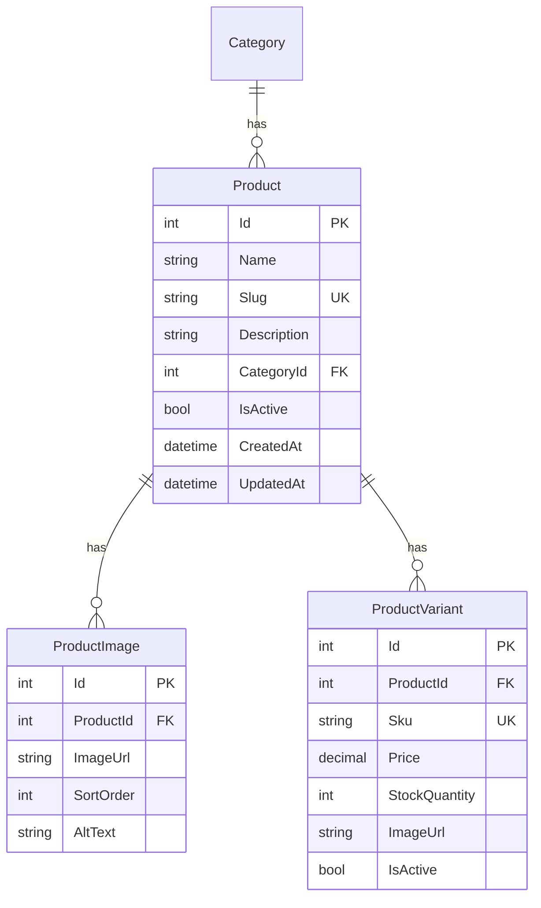
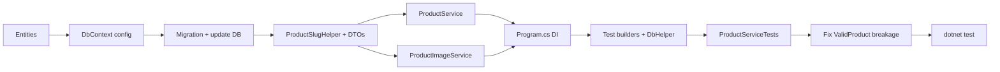

# Phase 1 — Schema & Product Shell

## Scope

Implement [roadmap Phase 1](d:\DevZone\Nexus\docs\product-variant-roadmap.md) only: **data layer + service foundation + tests**. Admin UI (`/admin/products`), paging, and update/delete belong to Phase 2.

**In scope:** entities, EF migration, `IProductService` (`CreateAsync`, `GetByIdAsync`), `IProductImageService`, DI registration, test builders, integration tests.

**Out of scope:** `ProductOption` / `VariantOptionValue` (Phase 3), `GetPagedAsync` / `UpdateAsync` (Phase 2), Blazor pages.

---

## Architecture (Phase 1 subset)



**Invariant:** Every product created via `ProductService.CreateAsync` gets exactly one default variant when the caller does not supply additional variants.

---

## 1. Entities

### Extend [`Data/Entities/Product.cs`](d:\DevZone\Nexus\Data\Entities\Product.cs)

Add fields from roadmap §4.2:

- `Slug` (string, required)
- `Description` (string?, max 4000)
- `CreatedAt`, `UpdatedAt` (DateTime, UTC)
- Navigation: `ICollection<ProductImage> Images`, `ICollection<ProductVariant> Variants`

### New entities in `Data/Entities/`

**`ProductImage.cs`** — `Id`, `ProductId`, `ImageUrl` (500), `SortOrder`, `AltText` (200, optional), nav to `Product`.

**`ProductVariant.cs`** — `Id`, `ProductId`, `Sku` (50), `Price` (decimal 18,2), `StockQuantity` (default 0), `ImageUrl` (500, optional), `IsActive` (default true), nav to `Product`.

---

## 2. EF Core configuration & migration

Update [`Data/ApplicationDbContext.cs`](d:\DevZone\Nexus\Data\ApplicationDbContext.cs):

| Entity | Configuration |
|--------|----------------|
| `Product` | `Slug` max 200, required, **unique index** `IX_Products_Slug`; `Description` max 4000; timestamps required |
| `ProductImage` | FK to Product, `OnDelete: Cascade`; index on `ProductId` |
| `ProductVariant` | `Sku` max 50, required, **unique index** `IX_ProductVariants_Sku`; `Price` precision (18,2); FK to Product, `OnDelete: Cascade` |

Add `DbSet<ProductImage>` and `DbSet<ProductVariant>`.

**Migration** (`dotnet ef migrations add ExtendProductWithVariants`):

- Add new columns to `Products` (`Slug`, `Description`, `CreatedAt`, `UpdatedAt`).
- **Backfill existing rows:** any product inserted by tests today lacks slug — migration `Up()` should set `Slug` from normalized name + `-{Id}` suffix to guarantee uniqueness, and set `CreatedAt`/`UpdatedAt` to `GETUTCDATE()`.
- Create `ProductImages` and `ProductVariants` tables.

Apply locally: `dotnet ef database update`.

---

## 3. Slug & SKU helpers

### [`Services/Products/ProductSlugHelper.cs`](d:\DevZone\Nexus\Services\Products\ProductSlugHelper.cs)

Copy the slug normalization logic from [`CategorySlugHelper`](d:\DevZone\Nexus\Services\Categories\CategorySlugHelper.cs) (Vietnamese diacritics, hyphenation). Keep separate to avoid cross-feature coupling; extract to shared helper later if desired.

Add **`EnsureUniqueSlugAsync`** in `ProductService` (not the helper): if `iphone-16` exists, try `iphone-16-2`, `iphone-16-3`, etc. This satisfies acceptance criterion *"duplicate names get disambiguated slugs"* when slug is omitted or collides.

### Default SKU (inline in `ProductService` for Phase 1)

When `CreateProductRequest.Sku` is empty, derive: `{product-slug}-default` (e.g. `iphone-16-default`). Validate global uniqueness; fail with clear error if supplied SKU already exists.

`ProductSkuHelper.cs` is deferred to Phase 3 per roadmap.

---

## 4. Services layer

Mirror [`Services/Categories/`](d:\DevZone\Nexus\Services\Categories\) structure under `Services/Products/`.

### Reuse shared models (Phase 1 shortcut)

Import [`ServiceResult<T>`](d:\DevZone\Nexus\Services\Categories\Models\ServiceResult.cs) from `Nexus.Services.Categories.Models` — no duplication yet. Phase 2 can extract to `Services/Common/` if needed.

### DTOs (`Services/Products/Models/`)

| Type | Phase 1 fields |
|------|----------------|
| `CreateProductRequest` | `Name`, `Slug?`, `Description?`, `CategoryId`, `IsActive`; variant fields: `Sku?`, `Price`, `StockQuantity`, `IsActive` (variant) |
| `ProductDetailDto` | Product fields + `CategoryName` + `IReadOnlyList<ProductVariantDto>` + `IReadOnlyList<ProductImageDto>` |
| `ProductVariantDto` | `Id`, `Sku`, `Price`, `StockQuantity`, `ImageUrl`, `IsActive` |
| `ProductImageDto` | `Id`, `ImageUrl`, `SortOrder`, `AltText` |

### `IProductService` / `ProductService`

```csharp
Task<ServiceResult<ProductDetailDto>> CreateAsync(CreateProductRequest request, CancellationToken ct = default);
Task<ProductDetailDto?> GetByIdAsync(int id, CancellationToken ct = default);
string GenerateSlug(string name);
Task<bool> IsSlugAvailableAsync(string slug, int? excludeId = null, CancellationToken ct = default);
```

**`CreateAsync` flow:**

1. Validate: name required; `CategoryId` exists; `Price >= 0`; `StockQuantity >= 0`.
2. Resolve slug: use normalized request slug, or `GenerateSlug(name)`, then `EnsureUniqueSlugAsync`.
3. Insert `Product` with `CreatedAt`/`UpdatedAt` = `DateTime.UtcNow`.
4. Insert one `ProductVariant` (default) in same transaction.
5. Return `ProductDetailDto` mapped via EF projection or explicit map.

**`GetByIdAsync`:** `AsNoTracking`, include variants (ordered by `Id`) and images (ordered by `SortOrder`), join category name for DTO.

### `IProductImageService` / `ProductImageService`

Mirror [`CategoryImageService`](d:\DevZone\Nexus\Services\Categories\CategoryImageService.cs):

- `UploadRelativePath = "uploads/products"`
- Same validation (2 MB, jpg/png/webp/gif)
- `SaveUploadedFileAsync`, `DeleteFileIfLocalAsync`, `IsLocalUploadPath`

Create [`wwwroot/uploads/products/.gitkeep`](d:\DevZone\Nexus\wwwroot\uploads\products\.gitkeep).

Phase 1 does **not** wire image upload into `CreateAsync` yet (no images in create request) — service exists so Phase 2 admin upload is ready.

### DI registration in [`Program.cs`](d:\DevZone\Nexus\Program.cs)

```csharp
builder.Services.AddScoped<IProductService, ProductService>();
builder.Services.AddScoped<IProductImageService, ProductImageService>();
```

---

## 5. Test infrastructure updates

### [`Nexus.Test.Integration/TestData/ProductTestDataBuilder.cs`](d:\DevZone\Nexus\Nexus.Test.Integration\TestData\ProductTestDataBuilder.cs) (new)

Bogus/helpers for:

- `ValidCreateProductRequest(int categoryId)` — name, price, stock
- `ValidProductWithSlug(int categoryId, string name, string slug)` — full entity for DbHelper inserts

### Update [`TestDataBuilders.cs`](d:\DevZone\Nexus\Nexus.Test.Integration\TestData\TestDataBuilders.cs)

Extend `ValidProduct()` with `Slug`, `Description`, `CreatedAt`, `UpdatedAt` so existing [`CategoryServiceTests`](d:\DevZone\Nexus\Nexus.Test.Integration\Features\Category\CategoryServiceTests.cs) (`DeleteAsync_WhenCategoryHasProducts`) still compiles after migration.

### Extend [`DbHelper.cs`](d:\DevZone\Nexus\Nexus.Test.Integration\Infrastructure\DbHelper.cs)

- `GetProductBySlugAsync(string slug)`
- `GetProductVariantsAsync(int productId)`
- `GetVariantBySkuAsync(string sku)`

---

## 6. Integration tests

New file: [`Nexus.Test.Integration/Features/Product/ProductServiceTests.cs`](d:\DevZone\Nexus\Nexus.Test.Integration\Features\Product\ProductServiceTests.cs)

Follow [`CategoryServiceTests`](d:\DevZone\Nexus\Nexus.Test.Integration\Features\Category\CategoryServiceTests.cs) lifecycle (`IClassFixture<TestDatabaseFixture>`, `TestWebApplicationFactory`, `DbHelper`, Respawn reset).

| Test | Asserts |
|------|---------|
| `CreateAsync_PersistsProductWithDefaultVariant` | Product + 1 variant in DB; SKU and price match request |
| `CreateAsync_AutoGeneratesSlug_WhenOmitted` | Slug derived from name |
| `CreateAsync_DisambiguatesSlug_WhenDuplicate` | Second product with same name gets `-2` suffix |
| `CreateAsync_WithDuplicateSku_ReturnsFailure` | Global SKU uniqueness enforced |
| `CreateAsync_WithInvalidCategory_ReturnsFailure` | Category FK validation |
| `GetByIdAsync_ReturnsProductWithVariants` | DTO includes variant list |
| `GetByIdAsync_WhenNotFound_ReturnsNull` | |
| `GenerateSlug_HandlesVietnameseDiacritics` | Same expectation as category test |
| `SaveUploadedFileAsync_SavesFileUnderProductsUploads` | Mirror category image test; cleanup file |

**Verification gate:** `dotnet test Nexus.sln` — all existing + new tests green.

---

## 7. Implementation order



---

## 8. Acceptance criteria mapping

| Criterion | How verified |
|-----------|--------------|
| Create without variants auto-creates default variant | `CreateAsync_PersistsProductWithDefaultVariant` |
| Product slug unique; duplicates disambiguated | `CreateAsync_DisambiguatesSlug_WhenDuplicate` + unique DB index |
| `dotnet test` passes | CI/local test run |

---

## 9. Risks & mitigations

| Risk | Mitigation |
|------|------------|
| Migration fails on existing `Products` rows | Backfill slug + timestamps in migration `Up()` |
| `CategoryServiceTests` break on new required `Product.Slug` | Update `TestDataBuilders.ValidProduct` before running tests |
| `ServiceResult` namespace coupling | Acceptable for Phase 1; extract in Phase 2 if product models grow |

---

## Estimated effort

**3–5 days** per roadmap — backend-only, no UI.
