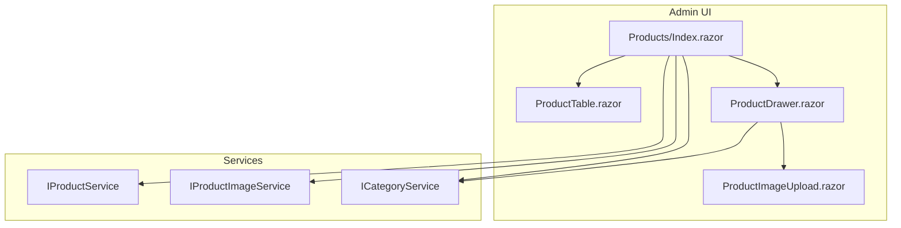
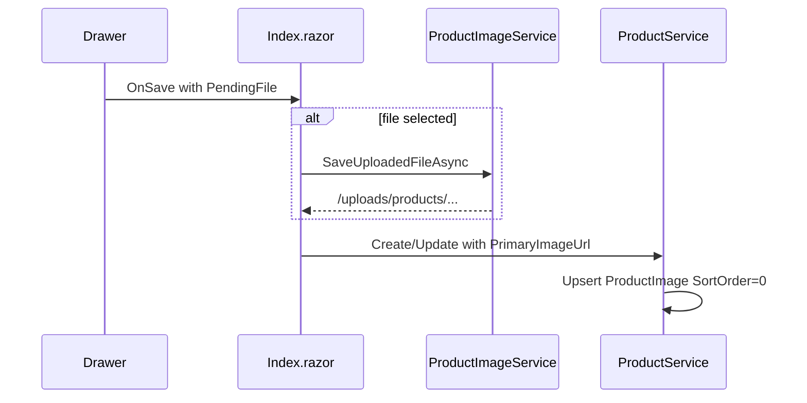

# Phase 2 — Admin Product List & Basic CRUD

## Scope

Per [product-variant-roadmap.md](d:\DevZone\Nexus\docs\product-variant-roadmap.md) Phase 2: admin can **list, create, edit, and soft-hide** products with a **single default variant** (SKU, price, stock). No multi-variant matrix (Phase 3), no public catalog (Phase 4).

**Phase 1 already provides:** [`ProductService.CreateAsync`](d:\DevZone\Nexus\Services\Products\ProductService.cs), `GetByIdAsync`, `ProductImageService`, entities, and 9 service tests.

**This phase adds:** `GetPagedAsync`, `UpdateAsync`, `SetActiveAsync`, admin UI, and expanded tests.

---

## Architecture



**Key difference from Categories:** products use **soft-delete** (`SetActiveAsync`) with hide/show actions — no hard-delete modal.

---

## Blazor binding convention

All new Razor components must use `@` when binding C# values to attributes:

```razor
value="@searchTerm"
disabled="@isSaving"
class="@drawerClass"
Items="@pagedResult.Items"
selected="@(categoryId == item.Id)"
```

Follow existing patterns in [`CategoryDrawer.razor`](d:\DevZone\Nexus\Components\Admin\Shared\CategoryDrawer.razor) and [`Categories/Index.razor`](d:\DevZone\Nexus\Components\Admin\Pages\Categories\Index.razor).

---

## 1. Service layer extensions

### New models in `Services/Products/Models/`

| File | Purpose |
|------|---------|
| `ProductQuery.cs` | `Search`, `CategoryId?`, `ProductStatusFilter` (All/Active/Hidden), `Page`, `PageSize` (default 6) |
| `ProductListItemDto.cs` | `Id`, `Name`, `Slug`, `ThumbnailUrl`, `CategoryId`, `CategoryName`, `Sku`, `Price`, `TotalStock`, `IsActive` |
| `UpdateProductRequest.cs` | Product fields + variant fields (mirror `CreateProductRequest` but `Slug` required on update) |

Reuse [`PagedResult<T>`](d:\DevZone\Nexus\Services\Categories\Models\PagedResult.cs) and [`ServiceResult<T>`](d:\DevZone\Nexus\Services\Categories\Models\ServiceResult.cs) from Categories — no duplication.

### Extend [`IProductService`](d:\DevZone\Nexus\Services\Products\IProductService.cs)

```csharp
Task<PagedResult<ProductListItemDto>> GetPagedAsync(ProductQuery query, CancellationToken ct = default);
Task<ServiceResult<ProductDetailDto>> UpdateAsync(int id, UpdateProductRequest request, CancellationToken ct = default);
Task<ServiceResult<bool>> SetActiveAsync(int id, bool isActive, CancellationToken ct = default);
```

### `GetPagedAsync` implementation

Mirror [`CategoryService.GetPagedAsync`](d:\DevZone\Nexus\Services\Categories\CategoryService.cs):

- **Search:** `Name` contains term OR any variant `Sku` contains term
- **Category filter:** `CategoryId` when set
- **Status:** `Active` / `Hidden` / `All`
- **Projection** (aggregated from variants/images):

| DTO field | Source |
|-----------|--------|
| `ThumbnailUrl` | First `ProductImage` by `SortOrder`, then `Id` |
| `Sku` | First variant by `Id` |
| `Price` | `Min(Price)` across variants |
| `TotalStock` | `Sum(StockQuantity)` across variants |
| `CategoryName` | Join `Category.Name` |

Order by `Name`, paginate with `Skip`/`Take`.

### `UpdateAsync` implementation

Phase 2 assumes **exactly one variant** per product (the default created in Phase 1):

1. Load product with variants and images (tracked).
2. Validate category exists, price/stock ≥ 0, slug available (exclude current id), SKU available (exclude current variant id).
3. Update product shell fields; set `UpdatedAt = UtcNow`.
4. Update first variant (`OrderBy Id`) — SKU, price, stock, `IsActive` from `VariantIsActive`.
5. Return `GetByIdAsync` result.

Image persistence is handled by the page layer (upload first, pass `ImageUrl` in request) — see §3.

### `SetActiveAsync` implementation

- Load product by id; return fail if not found.
- Set `IsActive`; update `UpdatedAt`.
- Return `ServiceResult<bool>.Ok(true)`.

### Extend `CreateProductRequest` / `UpdateProductRequest`

Add optional `string? PrimaryImageUrl` for the first gallery image. In `CreateAsync` / `UpdateAsync`, when provided:

- Create or replace `ProductImage` with `SortOrder = 0`.
- On replace, call `IProductImageService.DeleteFileIfLocalAsync` for removed local path (same pattern as category update).

---

## 2. Admin UI components

All pages live under [`Components/Admin/Pages/`](d:\DevZone\Nexus\Components\Admin\Pages\) and inherit auth + layout from [`_Imports.razor`](d:\DevZone\Nexus\Components\Admin\Pages\_Imports.razor) (`AdminLayout`, `[Authorize(Roles = Admin)]`).

### [`Components/Admin/Pages/Products/Index.razor`](d:\DevZone\Nexus\Components\Admin\Pages\Products\Index.razor)

`@page "/admin/products"` + `@rendermode InteractiveServer`

Mirror [`Categories/Index.razor`](d:\DevZone\Nexus\Components\Admin\Pages\Categories\Index.razor) structure:

| Area | Behavior |
|------|----------|
| Toolbar | Search input (debounced 300ms), status filter, **category filter** (`<select>` populated from `ICategoryService.GetPagedAsync` Active categories), "Add Product" button |
| Default status filter | **`Active`** (roadmap: hidden products excluded by default) |
| Table | `<ProductTable>` with paging |
| Drawer | `<ProductDrawer>` for create/edit |
| Toasts | `<AdminToast>` — same `ShowToast` pattern |
| No delete modal | Hide/show via `SetActiveAsync` instead |

**Save flow** (create/edit):

1. If `PendingFile` in drawer context → upload via `IProductImageService.SaveUploadedFileAsync`.
2. Map form model → `CreateProductRequest` / `UpdateProductRequest` with `PrimaryImageUrl`.
3. Call service; show toast; reload list.

**Edit load:** `GetByIdAsync` → map product + first variant + first image into `ProductFormModel`.

**Toggle visibility:** table action calls `SetActiveAsync(id, !item.IsActive)` with success/error toast.

### [`Components/Admin/Shared/ProductTable.razor`](d:\DevZone\Nexus\Components\Admin\Shared\ProductTable.razor)

Clone [`CategoryTable.razor`](d:\DevZone\Nexus\Components\Admin\Shared\CategoryTable.razor) structure with columns:

| Column | Content |
|--------|---------|
| Product | Thumbnail + name |
| Category | Category name |
| SKU | `item.Sku` |
| Price | VND formatted (e.g. `2.450.000 ₫`) |
| Stock | `item.TotalStock` |
| Status | Active / Hidden badge |
| Actions | Edit button, Hide/Show toggle (eye or eye-slash icon) |

Parameters: `Items`, `Page`, `PageSize`, `TotalCount`, `OnPageChanged`, `OnEdit`, `OnToggleActive`.

### [`Components/Admin/Shared/ProductDrawer.razor`](d:\DevZone\Nexus\Components\Admin\Shared\ProductDrawer.razor)

Clone [`CategoryDrawer.razor`](d:\DevZone\Nexus\Components\Admin\Shared\CategoryDrawer.razor):

| Field | Control |
|-------|---------|
| Name | `InputText` + validation |
| Slug | `InputText` + Generate button (`IProductService.GenerateSlug`) |
| Category | `<select>` bound to `CategoryId` |
| SKU | `InputText` (required) |
| Price | `InputNumber<decimal>` (VND, min 0) |
| Stock | `InputNumber<int>` (min 0) |
| Status | `<StatusRadioCards @bind-IsActive="Model.IsActive" />` |
| Image | `<ProductImageUpload>` |
| Description | `InputTextArea` |

Expose `ProductFormModel`, `ProductFormSubmitContext(Model, PendingFile)` like category drawer.

### [`Components/Admin/Shared/ProductImageUpload.razor`](d:\DevZone\Nexus\Components\Admin\Shared\ProductImageUpload.razor)

Copy [`CategoryImageUpload.razor`](d:\DevZone\Nexus\Components\Admin\Shared\CategoryImageUpload.razor) verbatim (same parameters: `ImageUrl`, `PreviewUrl`, `OnFileSelected`, `InputClass`). Uses `ProductImageService.MaxFileSizeBytes` in drawer file-read logic.

### UI reference

Layout and styling from [`mockup/product-management3.html`](d:\DevZone\Nexus\mockup\product-management3.html); implementation reuses existing Tailwind classes from category components.

---

## 3. Image handling detail



On update when image URL changes and old path was local → `DeleteFileIfLocalAsync` old file.

---

## 4. Integration tests

### Extend [`ProductServiceTests.cs`](d:\DevZone\Nexus\Nexus.Test.Integration\Features\Product\ProductServiceTests.cs)

| Test | Asserts |
|------|---------|
| `GetPagedAsync_FiltersBySearchName` | Name match returns product |
| `GetPagedAsync_FiltersBySearchSku` | SKU match returns product |
| `GetPagedAsync_FiltersByCategory` | Only products in category |
| `GetPagedAsync_FiltersByStatus` | Active/Hidden filters work |
| `GetPagedAsync_AggregatesPriceAndStock` | Min price + sum stock correct |
| `UpdateAsync_UpdatesProductAndVariant` | Fields persisted |
| `UpdateAsync_WithDuplicateSku_ReturnsFailure` | Excludes self |
| `SetActiveAsync_TogglesIsActive` | Product hidden then shown |

### New [`ProductPageTests.cs`](d:\DevZone\Nexus\Nexus.Test.Integration\Features\Product\ProductPageTests.cs)

Mirror [`CategoryPageTests.cs`](d:\DevZone\Nexus\Nexus.Test.Integration\Features\Category\CategoryPageTests.cs):

- `GET /admin/products` as Admin → 200 OK
- `GET /admin/products` as Customer → redirect/unauthorized

### Verification

`dotnet test Nexus.Test.Integration/Nexus.Test.Integration.csproj` — all tests green.

---

## 5. File checklist

| Action | Path |
|--------|------|
| Add | `Services/Products/Models/ProductQuery.cs` |
| Add | `Services/Products/Models/ProductListItemDto.cs` |
| Add | `Services/Products/Models/UpdateProductRequest.cs` |
| Modify | `Services/Products/IProductService.cs` |
| Modify | `Services/Products/ProductService.cs` |
| Modify | `Services/Products/Models/CreateProductRequest.cs` (add `PrimaryImageUrl`) |
| Add | `Components/Admin/Pages/Products/Index.razor` |
| Add | `Components/Admin/Shared/ProductTable.razor` |
| Add | `Components/Admin/Shared/ProductDrawer.razor` |
| Add | `Components/Admin/Shared/ProductImageUpload.razor` |
| Add | `Nexus.Test.Integration/Features/Product/ProductPageTests.cs` |
| Modify | `Nexus.Test.Integration/Features/Product/ProductServiceTests.cs` |

Nav link `/admin/products` already exists in [`AdminNavMenu.razor`](d:\DevZone\Nexus\Components\Admin\Layout\AdminNavMenu.razor) — no change needed.

---

## 6. Acceptance criteria

| Criterion | Verification |
|-----------|--------------|
| Admin CRUD at `/admin/products` | Manual + page tests |
| Default filter shows Active only; toggle shows Hidden | `GetPagedAsync` test + UI default |
| Validation: name, category, SKU, price ≥ 0, stock ≥ 0 | Drawer `DataAnnotationsValidator` + service checks |
| Toast feedback matches category UX | Same `AdminToast` component |
| Single variant per product in Phase 2 | Update targets first variant only |

---

## 7. Implementation order

1. Models + `IProductService` interface
2. `GetPagedAsync`, `UpdateAsync`, `SetActiveAsync` + image upsert in create/update
3. `ProductImageUpload` → `ProductDrawer` → `ProductTable` → `Index.razor`
4. Service tests → page tests → full test run

**Estimated effort:** 5–7 days per roadmap.
