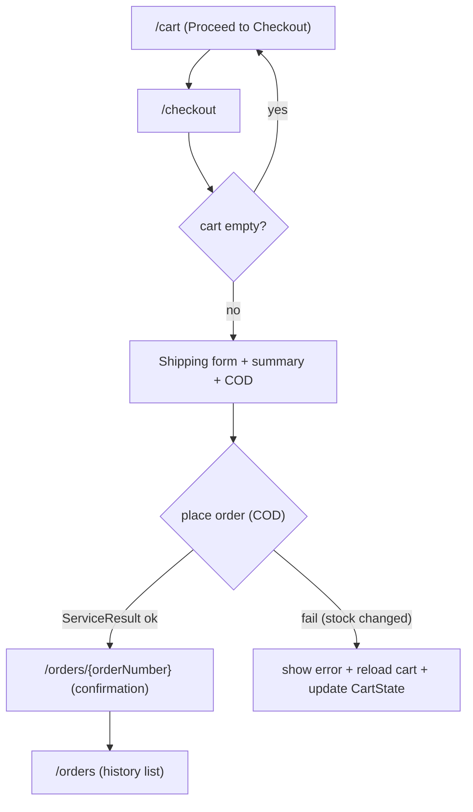

# Phase 3 — Checkout & order pages (customer)

Wire the Phase 2 `IOrderService` into customer UI: `/checkout`, `/orders`, `/orders/{orderNumber}`, and the cart's checkout button. All new pages use `@layout StorefrontLayout`, `@rendermode InteractiveServer`, and `[Authorize(Roles = IdentitySeedData.CustomerRole)]`, following [Components/Pages/Cart/Index.razor](Components/Pages/Cart/Index.razor) and [Components/Pages/Products/Detail.razor](Components/Pages/Products/Detail.razor).

## Flow

## 3.1 Checkout page — `Components/Pages/Checkout/Index.razor`

- Directives: `@page "/checkout"`, `@layout StorefrontLayout`, `@rendermode InteractiveServer`, `@attribute [Authorize(Roles = IdentitySeedData.CustomerRole)]`.
- Inject `ICartService`, `IOrderService`, `CartState`, `AuthenticationStateProvider`, `NavigationManager`, and `UserManager<ApplicationUser>` (to prefill `FullName`).
- `OnInitializedAsync`: resolve `userId` (like the cart page via `ClaimTypes.NameIdentifier`), load cart. If `cart.IsEmpty` → `Navigation.NavigateTo("/cart")`. Prefill `form.ShipFullName` from `UserManager.GetUserAsync(authState.User)`.
- Form: `EditForm Model="form"` + `DataAnnotationsValidator` (pattern already used in [Components/Admin/Shared/ProductDrawer.razor](Components/Admin/Shared/ProductDrawer.razor)). A private `CheckoutFormModel` with DataAnnotations covering FR-ORD-02:
  - `[Required]` FullName, Phone, Street, City, Country; State and PostalCode collected but optional.
- Payment method: radio group defaulting to COD; render PayPal as a disabled "Coming soon" option (Phase 4). Only COD is submittable.
- Order summary panel reuses cart totals (`Subtotal`, `ShippingFee` "Free" when 0, `TaxAmount` labelled "VAT (8%)", `Total`) via `MoneyFormatter.Format(...)`, matching the cart page.
- Submit handler (3.3): build `CheckoutRequest` (`Method = PaymentMethod.Cod`), call `IOrderService.CreateOrderFromCartAsync(userId, request)`.
  - Success → `CartState.SetCount(0)`; `Navigation.NavigateTo($"/orders/{result.Data!.OrderNumber}")`.
  - Failure → show `result.Error` inline, reload cart and `CartState.SetCount(cart.TotalQuantity)` (covers stale-stock rejection from Phase 2).
  - Guard with an `isSubmitting` flag (like `isBusy`) to prevent double submit.

## 3.2 Wire cart button — [Components/Pages/Cart/Index.razor](Components/Pages/Cart/Index.razor)

Currently an inert `<button>` (lines 165-169). Change to navigate to `/checkout` (either an `<a href="/checkout">` styled identically, or `@onclick="() => Navigation.NavigateTo(\"/checkout\")"`), keeping the existing `disabled` when any line is out of stock. Add `@inject NavigationManager Navigation` if using onclick.

## 3.4 Order detail / confirmation — `Components/Pages/Orders/Detail.razor`

- `@page "/orders/{OrderNumber}"`, StorefrontLayout, InteractiveServer, Customer-authorized.
- Inject `IOrderService`, `AuthenticationStateProvider`.
- `[Parameter] public string OrderNumber { get; set; }`; in `OnParametersSetAsync` resolve `userId`, call `GetOrderAsync(userId, OrderNumber)`.
- If null → "Order not found" panel (mirror the product-not-found block in [Components/Pages/Products/Detail.razor](Components/Pages/Products/Detail.razor)). Ownership is enforced by the service (`userId` filter).
- Render: order number, `CreatedAt`, `Status`, payment method + `PaymentStatus`, shipping address, line items (`ProductName`, `VariantLabel`, `Sku`, `UnitPrice`, `Quantity`, `LineTotal`), and totals. Doubles as the COD confirmation page (a success banner when arriving fresh is optional).

## 3.5 Order history — `Components/Pages/Orders/Index.razor`

- `@page "/orders"`, StorefrontLayout, InteractiveServer, Customer-authorized.
- Inject `IOrderService`, `AuthenticationStateProvider`. Load `GetOrderHistoryAsync(userId)`.
- List newest-first rows (`OrderNumber`, `CreatedAt`, `Status`, `ItemCount`, `Total`), each linking to `/orders/{OrderNumber}`. Empty state mirrors the empty-cart panel with a link to `/products`.

## 3.6 Nav (minor)

Add an "Orders" link for signed-in users in [Components/Storefront/Layout/SiteHeader.razor](Components/Storefront/Layout/SiteHeader.razor) inside the existing `<AuthorizeView><Authorized>` block (near the account icon), pointing to `/orders`.

## 3.7 Integration tests — `Nexus.Test.Integration/Features/Orders/OrderPageTests.cs`

Mirror [Features/Cart/CartPageTests.cs](Nexus.Test.Integration/Features/Cart/CartPageTests.cs) (HTTP-level, `X-Test-Roles` / `X-Test-Anonymous` headers; default identity is Admin = lacks Customer). Seed a cart item for the acting user via a factory-scoped `ICartService.AddItemAsync` (as in `OrderServiceTests`), since the acting user is the fixture's seeded `TestAuthHandler.TestUserId`.

- `/checkout` as Customer with a cart item → 200, contains "Checkout".
- `/checkout` as non-Customer (default Admin) → redirect/forbidden.
- `/checkout` anonymous (`X-Test-Anonymous`) → redirect to `Account/Login`.
- `/orders` as Customer → 200.
- `/orders` anonymous → redirect to login.
- `/orders/{orderNumber}` after placing an order via `IOrderService` for the acting user → 200, contains the order number.
- `/orders/{orderNumber}` for another user's order → 200 with "not found" content (ownership enforced).

COD end-to-end at the service layer is already covered by `OrderServiceTests` (Phase 2).

## Verify

- `dotnet build Nexus.csproj` clean; `dotnet build` test project clean.
- Run `dotnet test --filter FullyQualifiedName~OrderPageTests`, then the full suite (currently 93/93) to confirm no regressions.
- Tick Phase 3 acceptance criteria and milestone checklist in [docs/order-payment-roadmap.md](docs/order-payment-roadmap.md).

## Decisions (chosen; low-risk)

- PayPal radio is shown but disabled ("Coming soon") until Phase 4; COD is the default and only submittable method.
- State/PostalCode are collected but optional; FullName/Phone/Street/City/Country are required (FR-ORD-02).
- The confirmation page reuses `/orders/{orderNumber}` rather than a separate route.

## Out of scope

PayPal create/capture (Phase 4), admin order management (Phase 5), guest checkout (FR-ORD-06, Could).