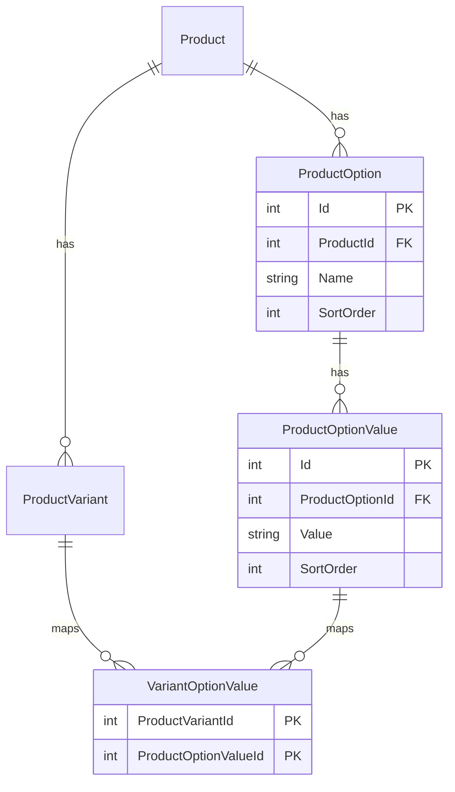
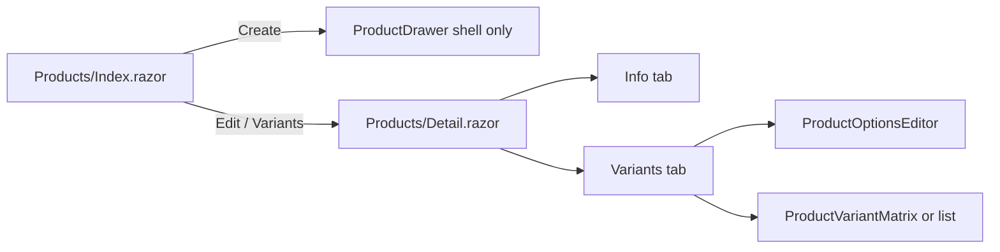

# Phase 3 — Multi-variant & Options

## Scope

Per [product-variant-roadmap.md](d:\DevZone\Nexus\docs\product-variant-roadmap.md) Phase 3: admin can define **per-product options** (e.g. Color, Storage), **generate variant combinations**, and **edit variants** via matrix (2 options) or list (3+ options). Existing products from Phase 1–2 (single default variant, no options) must keep working.

**In scope:** new entities + migration, `SaveOptionsAsync`, `GenerateVariantsAsync`, `UpsertVariantsAsync`, `ProductSkuHelper`, admin detail page + variant UI, integration tests.

**Out of scope:** public catalog (`GetBySlugAsync`, `ResolveVariantAsync` — Phase 4), cart/order (Phase 5).

---

## Architecture





**Navigation change:** list **Edit** opens [`/admin/products/{id}`](d:\DevZone\Nexus\Components\Admin\Pages\Products\Detail.razor) instead of the drawer. Drawer remains for **quick create** (shell + default variant), then redirect to Detail for variant setup.

---

## Blazor binding convention

All new/edited Razor must use `@` when binding C# values to attributes:

```razor
value="@activeTab"
disabled="@isGenerating"
class="@cellClass"
Items="@variants"
selected="@(selectedOptionId == option.Id)"
```

Follow patterns in [`CategoryDrawer.razor`](d:\DevZone\Nexus\Components\Admin\Shared\CategoryDrawer.razor) and [`Products/Index.razor`](d:\DevZone\Nexus\Components\Admin\Pages\Products\Index.razor).

---

## 1. Data layer

### New entities in [`Data/Entities/`](d:\DevZone\Nexus\Data\Entities/)

| Entity | Fields |
|--------|--------|
| `ProductOption` | `Id`, `ProductId`, `Name` (100), `SortOrder` |
| `ProductOptionValue` | `Id`, `ProductOptionId`, `Value` (100), `SortOrder` |
| `VariantOptionValue` | `ProductVariantId`, `ProductOptionValueId` (composite PK) |

### Extend existing entities

- [`Product.cs`](d:\DevZone\Nexus\Data\Entities\Product.cs): add `ICollection<ProductOption> Options`
- [`ProductVariant.cs`](d:\DevZone\Nexus\Data\Entities\ProductVariant.cs): add `ICollection<VariantOptionValue> OptionValues`

### EF configuration in [`ApplicationDbContext.cs`](d:\DevZone\Nexus\Data\ApplicationDbContext.cs)

- `ProductOption` → FK to Product, cascade delete
- `ProductOptionValue` → FK to ProductOption, cascade delete
- `VariantOptionValue` → composite PK; FK to `ProductVariant` (cascade) and `ProductOptionValue` (restrict — block value delete if referenced)
- Indexes: `IX_ProductOptions_ProductId`, `IX_ProductOptionValues_ProductOptionId`, `IX_VariantOptionValues_ProductVariantId`

### Migration

`dotnet ef migrations add AddProductOptionsAndVariantMappings`

No backfill required — existing variants have **no option links** and remain valid single-SKU products until admin adds options on Detail.

---

## 2. Service models

Add under [`Services/Products/Models/`](d:\DevZone\Nexus\Services\Products\Models\):

| Type | Purpose |
|------|---------|
| `ProductOptionDto` | `Id`, `Name`, `SortOrder`, `Values` |
| `ProductOptionValueDto` | `Id`, `Value`, `SortOrder` |
| `SaveProductOptionsRequest` | `IReadOnlyList<ProductOptionInput>` (name, sortOrder, values[]) — full replace |
| `ProductOptionInput` / `ProductOptionValueInput` | Id optional for new rows |
| `GenerateVariantsRequest` | `DefaultPrice`, `DefaultStock`, `DefaultIsActive`, optional `SkuPrefix` |
| `UpsertVariantsRequest` | `IReadOnlyList<VariantUpsertInput>`, `IReadOnlyList<int> DeleteVariantIds` |
| `VariantUpsertInput` | `Id?`, `Sku`, `Price`, `StockQuantity`, `IsActive`, `ImageUrl?`, `OptionValueIds[]` |
| `BulkVariantActionRequest` | `VariantIds`, `Action` (SetPrice, AdjustStock, SetActive) + payload |

### Extend existing DTOs

- [`ProductDetailDto`](d:\DevZone\Nexus\Services\Products\Models\ProductDetailDto.cs): add `IReadOnlyList<ProductOptionDto> Options`
- [`ProductVariantDto`](d:\DevZone\Nexus\Services\Products\Models\ProductVariantDto.cs): add `OptionValueIds`, `OptionLabel` (e.g. `"Orange / 32GB"`)

[`ProductListItemDto`](d:\DevZone\Nexus\Services\Products\Models\ProductListItemDto.cs) unchanged — already aggregates min price and sum stock from [`GetPagedAsync`](d:\DevZone\Nexus\Services\Products\ProductService.cs).

---

## 3. Service layer

### [`ProductSkuHelper.cs`](d:\DevZone\Nexus\Services\Products\ProductSkuHelper.cs) (new)

Generate SKU from product slug + option value slugs:

```
{productSlug}-{valueSlug1}-{valueSlug2}
```

Example: `iphone-16` + `orange` + `32gb` → `iphone-16-orange-32gb`. Reuse slug normalization from [`ProductSlugHelper`](d:\DevZone\Nexus\Services\Products\ProductSlugHelper.cs) for value segments. Truncate to 50 chars if needed.

### Extend [`IProductService`](d:\DevZone\Nexus\Services\Products\IProductService.cs)

```csharp
Task<ServiceResult<ProductDetailDto>> SaveOptionsAsync(int productId, SaveProductOptionsRequest request, CancellationToken ct = default);
Task<ServiceResult<IReadOnlyList<ProductVariantDto>>> GenerateVariantsAsync(int productId, GenerateVariantsRequest request, CancellationToken ct = default);
Task<ServiceResult<ProductDetailDto>> UpsertVariantsAsync(int productId, UpsertVariantsRequest request, CancellationToken ct = default);
Task<ServiceResult<int>> BulkUpdateVariantsAsync(int productId, BulkVariantActionRequest request, CancellationToken ct = default);
```

### `SaveOptionsAsync`

1. Load product with options, values, variants + variant option links.
2. Validate: at least 0 options allowed; option names/values non-empty; no duplicate option names per product.
3. **Block removal** of an option value that is linked to any variant (return clear error).
4. Replace option tree: remove unreferenced options/values, upsert by Id or create new.
5. Return updated `GetByIdAsync`.

### `GenerateVariantsAsync`

1. Require product has ≥1 option, each with ≥1 value.
2. Compute Cartesian product of all option value sets.
3. For each combination:
   - If variant with same `OptionValueIds` set exists → **skip** (merge, no duplicate).
   - Else create variant with auto SKU (`ProductSkuHelper`), `DefaultPrice`/`DefaultStock`/`DefaultIsActive`.
4. Validate global SKU uniqueness before save; fail entire batch on conflict.
5. Return list of **newly created** variants.

Admin omits invalid combos (e.g. no Red+18GB) by **not generating** them — generation creates all combos; admin **deletes** unwanted rows via `UpsertVariantsAsync` or leaves cells empty in matrix (no variant = not offered).

**Clarification for implementation:** `GenerateVariantsAsync` creates the full Cartesian product; admin removes unwanted variants afterward. Matrix empty cells = no variant row exists.

### `UpsertVariantsAsync`

- Create/update/delete variant rows in one transaction.
- Each variant must have exactly **one option value per product option** when options exist; zero option links allowed only when product has no options (legacy single-variant).
- Enforce SKU uniqueness (exclude self on update).
- On delete: remove variant + `VariantOptionValue` rows (cascade).
- Block delete if it would leave product with zero variants while `IsActive` (or warn and auto-deactivate product).

### `BulkUpdateVariantsAsync`

- **SetPrice:** apply same price to selected variant IDs.
- **AdjustStock:** add delta to stock (floor at 0).
- **SetActive:** toggle `IsActive` on selected variants.

### Update [`GetByIdAsync`](d:\DevZone\Nexus\Services\Products\ProductService.cs)

Include options (ordered), variant option value IDs, and computed `OptionLabel` in projection.

### Refactor Phase 2 paths

- [`UpdateAsync`](d:\DevZone\Nexus\Services\Products\ProductService.cs): update **product shell only** (name, slug, description, category, images, `IsActive`). Remove single-variant SKU/price/stock fields from [`UpdateProductRequest`](d:\DevZone\Nexus\Services\Products\Models\UpdateProductRequest.cs) — those move to variant upsert on Detail.
- [`ProductDrawer`](d:\DevZone\Nexus\Components\Admin\Shared\ProductDrawer.razor): remove SKU/price/stock fields; keep shell fields for **create** only. Create still uses [`CreateProductRequest`](d:\DevZone\Nexus\Services\Products\Models\CreateProductRequest.cs) with default variant.
- [`SetActiveAsync`](d:\DevZone\Nexus\Services\Products\ProductService.cs): when `isActive=true`, require ≥1 active variant.

---

## 4. Admin UI

### [`Components/Admin/Pages/Products/Detail.razor`](d:\DevZone\Nexus\Components\Admin\Pages\Products\Detail.razor) (new)

`@page "/admin/products/{ProductId:int}"` + `@rendermode InteractiveServer`

**Header:** product name, back link to `/admin/products`, save toasts.

**Tabs:** `Info` | `Variants` (tab state via `activeTab` string, buttons with `class="@GetTabClass("info")"`)

#### Info tab

- Edit shell: name, slug, category, description, status, primary image (reuse [`ProductImageUpload`](d:\DevZone\Nexus\Components\Admin\Shared\ProductImageUpload.razor))
- Save → `UpdateAsync` (shell only)

#### Variants tab

Layout top-to-bottom:

1. [`ProductOptionsEditor.razor`](d:\DevZone\Nexus\Components\Admin\Shared\ProductOptionsEditor.razor) — add/remove/reorder options and values; **Save Options** → `SaveOptionsAsync`
2. **Generate Variants** panel — default price, stock, SKU prefix; button → `GenerateVariantsAsync`
3. Variant display:
   - **2 options** → [`ProductVariantMatrix.razor`](d:\DevZone\Nexus\Components\Admin\Shared\ProductVariantMatrix.razor) (rows = option1 values, cols = option2 values)
   - **1 or 3+ options** → flat [`ProductVariantList.razor`](d:\DevZone\Nexus\Components\Admin\Shared\ProductVariantList.razor) table (SKU, option label, price, stock, active, edit)
4. **Bulk actions** bar — select variants, set price / adjust stock / activate-deactivate → `BulkUpdateVariantsAsync`

**Matrix cell behavior:**

- Empty cell → no variant; click **Add** opens inline/modal editor → `UpsertVariantsAsync` create
- Filled cell → shows stock @ price; click → edit SKU, price, stock, active
- Cell delete → remove variant via `UpsertVariantsAsync`

### [`ProductOptionsEditor.razor`](d:\DevZone\Nexus\Components\Admin\Shared\ProductOptionsEditor.razor)

- Dynamic list of options (name input, up/down reorder)
- Per option: dynamic values list (text input, add/remove)
- Parameters: `Options` model, `OnSave` callback
- All inputs use `@bind-Value`, `@onclick`, `value="@..."` with `@` prefix

### [`ProductVariantMatrix.razor`](d:\DevZone\Nexus\Components\Admin\Shared\ProductVariantMatrix.razor)

- Parameters: `ProductId`, `Option1Values`, `Option2Values`, `Variants`, `OnUpsert`, `OnDelete`
- Render grid per roadmap §3.8; format price with `vi-VN` culture (same as [`ProductTable`](d:\DevZone\Nexus\Components\Admin\Shared\ProductTable.razor))

### Refactor [`Products/Index.razor`](d:\DevZone\Nexus\Components\Admin\Pages\Products\Index.razor)

- `OpenEditDrawerAsync` → `NavigationManager.NavigateTo($"/admin/products/{id}")`
- After successful create → navigate to Detail for variant setup
- Remove edit path from drawer (drawer = create only)

### Refactor [`ProductTable.razor`](d:\DevZone\Nexus\Components\Admin\Shared\ProductTable.razor)

- Add optional **Manage variants** icon linking to `/admin/products/{id}` (or make Edit navigate there — one button is enough)

---

## 5. Integration tests

Extend [`ProductServiceTests.cs`](d:\DevZone\Nexus\Nexus.Test.Integration\Features\Product\ProductServiceTests.cs):

| Test | Asserts |
|------|---------|
| `SaveOptionsAsync_PersistsColorAndStorage` | 2 options, 3+2 values saved |
| `SaveOptionsAsync_BlocksDeleteOfReferencedValue` | Error when value linked to variant |
| `GenerateVariantsAsync_CreatesCartesianProduct` | 3×2 = 6 variants for color×storage |
| `GenerateVariantsAsync_SkipsExistingCombinations` | Second call adds 0 duplicates |
| `GenerateVariantsAsync_RejectsDuplicateSku` | Clear failure |
| `UpsertVariantsAsync_CreatesVariantForSubset` | iPhone example: 4 of 6 combos |
| `UpsertVariantsAsync_DeletesVariant` | Row removed; stock aggregate updates |
| `GetByIdAsync_IncludesOptionsAndVariantLabels` | `OptionLabel` = `"Yellow / 32GB"` |
| `SetActiveAsync_RequiresActiveVariant` | Cannot activate product with no active variants |
| `GetPagedAsync_StillAggregatesMultiVariantProduct` | Min price + sum stock |

Add [`ProductDetailPageTests.cs`](d:\DevZone\Nexus\Nexus.Test.Integration\Features\Product\ProductDetailPageTests.cs):

- `GET /admin/products/{id}` as Admin → 200 OK

Extend [`DbHelper`](d:\DevZone\Nexus\Nexus.Test.Integration\Infrastructure\DbHelper.cs): insert options/values, query variant by option value set.

**Verification:** `dotnet test Nexus.Test.Integration/Nexus.Test.Integration.csproj` — all tests green.

---

## 6. iPhone acceptance example (manual + test)

| Color | Storage | SKU | Price | Stock |
|-------|---------|-----|-------|-------|
| Orange | 32GB | `IPH16-ORG-32` | 24,990,000 | 12 |
| Red | 32GB | `IPH16-RED-32` | 24,990,000 | 8 |
| Yellow | 18GB | `IPH16-YEL-18` | 22,990,000 | 5 |
| Yellow | 32GB | `IPH16-YEL-32` | 24,990,000 | 3 |

Flow: save options → generate 3×2=6 → delete Red+18GB and Orange+18GB variants → edit remaining 4 cells.

---

## 7. Implementation order

1. Entities + migration + DbContext
2. DTOs + `ProductSkuHelper`
3. `SaveOptionsAsync`, `GenerateVariantsAsync`, `UpsertVariantsAsync`, `BulkUpdateVariantsAsync`; extend `GetByIdAsync`; refactor `UpdateAsync` / `UpdateProductRequest`
4. `ProductOptionsEditor` → `ProductVariantMatrix` + `ProductVariantList` → `Detail.razor`
5. Refactor `Index.razor`, `ProductDrawer`, `ProductTable`
6. Tests + full test run

---

## 8. Risks and mitigations

| Risk | Mitigation |
|------|------------|
| Breaking Phase 2 edit drawer | Drawer becomes create-only; edit moves to Detail |
| `UpdateProductRequest` breaking change | Update tests + Detail Info tab; remove variant fields from request |
| Matrix UI complexity | Ship list view first if needed; matrix required for 2-option case per roadmap |
| Large Cartesian products (4×4×4) | Generation allowed; warn in UI if combos > 50; list view for 3+ options |

**Estimated effort:** 7–10 days per roadmap.
