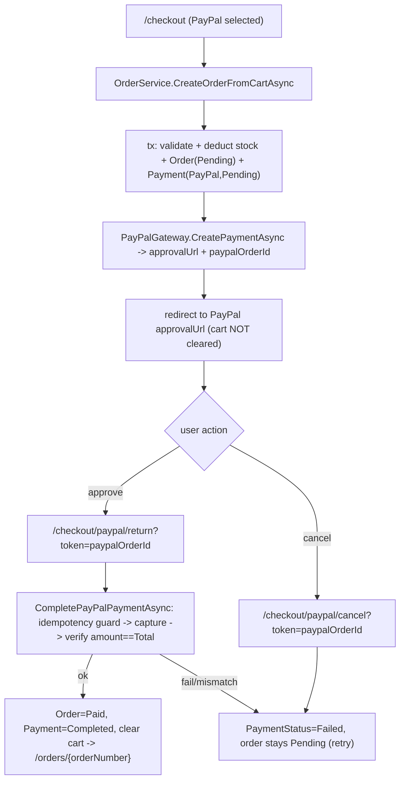

# Phase 4 — PayPal gateway

Add PayPal (Orders v2 REST, USD, capture-on-return) behind an `IPaymentGateway` abstraction, keeping COD working. Extend [Services/Orders/OrderService.cs](Services/Orders/OrderService.cs) with a PayPal create → approve → capture flow, wire the checkout + return/cancel pages, and test with a fake gateway (no network).

> Security: the shared Client ID/Secret go into .NET user-secrets only (never appsettings/git). Rotate them in the PayPal dashboard afterward since they were shared in plaintext. `appsettings.json` gets only a non-secret `PayPal:BaseUrl` (sandbox).

## Flow (capture-on-return)



## 4.1 / 4.5 Abstraction + resolver — `Services/Payments/`

- `Models/PaymentInitiation.cs`: `record PaymentInitiation(string? GatewayOrderId, string? ApprovalUrl)`.
- `Models/PaymentResult.cs`: `record PaymentResult(bool Success, string? TransactionRef, decimal CapturedAmount, string Currency, string? RawJson, string? Error)`.
- `IPaymentGateway.cs`:

```csharp
public interface IPaymentGateway
{
    PaymentMethod Method { get; }
    Task<ServiceResult<PaymentInitiation>> CreatePaymentAsync(
        Order order, string returnUrl, string cancelUrl, CancellationToken ct = default);
    Task<ServiceResult<PaymentResult>> CapturePaymentAsync(
        string gatewayOrderId, CancellationToken ct = default);
}
```

- `IPaymentGatewayResolver` + `PaymentGatewayResolver(IEnumerable<IPaymentGateway> gateways)` → `Resolve(PaymentMethod m) => gateways.First(g => g.Method == m)`. Reuse `ServiceResult<T>` from `Nexus.Services.Categories.Models`.

## 4.2 COD gateway — `Services/Payments/CodPaymentGateway.cs`

`Method => PaymentMethod.Cod`; `CreatePaymentAsync` returns `Ok(new PaymentInitiation(null, null))` (no redirect); `CapturePaymentAsync` returns `Ok(new PaymentResult(true, null, 0m, "USD", null, null))` (never used for COD).

## 4.3 Options — `Services/Payments/PayPalOptions.cs`

`{ BaseUrl = "https://api-m.sandbox.paypal.com", ClientId, Secret }`. Bind `builder.Configuration.GetSection("PayPal")`. Add non-secret defaults to [appsettings.json](appsettings.json):

```json
"PayPal": { "BaseUrl": "https://api-m.sandbox.paypal.com", "ClientId": "", "Secret": "" }
```

Secrets set locally (implementation step, not committed):
`dotnet user-secrets set "PayPal:ClientId" "<id>"` and `"PayPal:Secret" "<secret>"`.

## 4.4 PayPal gateway — `Services/Payments/PayPalPaymentGateway.cs`

Typed `HttpClient` + `IOptions<PayPalOptions>`, `System.Text.Json`.
- OAuth: `POST {BaseUrl}/v1/oauth2/token` with Basic auth (`clientId:secret`), body `grant_type=client_credentials` → `access_token`.
- Create: `POST /v2/checkout/orders` with `intent=CAPTURE`, `purchase_units[0].amount = { currency_code: "USD", value: order.Total.ToString("F2", InvariantCulture) }`, `application_context.return_url/cancel_url`, `reference_id = order.OrderNumber` → parse `id` (paypalOrderId) + approval `rel="approve"` link.
- Capture: `POST /v2/checkout/orders/{id}/capture` → parse status `COMPLETED`, capture id, and `purchase_units[0].payments.captures[0].amount.value/currency_code`. Return `PaymentResult` with `RawJson` = response body. Network/parse errors → `Fail(...)`.

## 4.6 / 4.9 OrderService changes — [Services/Orders/OrderService.cs](Services/Orders/OrderService.cs) + [IOrderService.cs](Services/Orders/IOrderService.cs)

- Inject `IPaymentGatewayResolver`.
- Add `string? ReturnUrlBase` to [CheckoutRequest.cs](Services/Orders/Models/CheckoutRequest.cs) (checkout page passes `Navigation.BaseUri`).
- `CreateOrderFromCartAsync`: replace the `Method != Cod` rejection with allow `{Cod, PayPal}`. Keep the existing tx (validate + atomic stock deduct + Order/Payment/OrderNumber). Then:
  - COD (unchanged): clear cart, commit, return `PlaceOrderResult(OrderNumber)`.
  - PayPal (inside the same tx, so a gateway failure rolls back the stock deduction): build `returnUrl = {base}checkout/paypal/return`, `cancelUrl = {base}checkout/paypal/cancel`; call `gateway.CreatePaymentAsync(order, returnUrl, cancelUrl)`. On fail → rollback + `Fail`. On success → set `payment.GatewayTransactionRef = initiation.GatewayOrderId` (stable lookup key), payment stays `Pending`, do NOT clear cart, commit, return `PlaceOrderResult(OrderNumber, initiation.ApprovalUrl)`.
- New `CompletePayPalPaymentAsync(userId, paypalOrderId)` → `ServiceResult<OrderDto>`:
  - Load tracked order+payment by `GatewayTransactionRef == paypalOrderId && UserId == userId` (Include Items). Null → `Fail("Order not found.")`.
  - Idempotency: if `order.PaymentStatus == Completed` → return `Ok(MapOrder(order))` without re-capturing (guards refresh/double return, FR-PAY-04). If `Cancelled` → `Fail`.
  - `gateway.CapturePaymentAsync(paypalOrderId)`. On `!Success` → `payment.Status=Failed`, `order.PaymentStatus=Failed`, save, `Fail`.
  - Verify `CapturedAmount == order.Total` and `Currency == "USD"` (FR-PAY-02) → else mark failed + `Fail("amount mismatch")`.
  - Success → `order.Status=Paid`, `order.PaymentStatus=Completed`, `payment.Status=Completed`, `payment.CompletedAt=now`, `payment.RawPayloadJson = result.RawJson` (holds capture id; keep `GatewayTransactionRef` = PayPal order id for stable idempotent lookups), clear cart, save, `Ok(MapOrder(order))`.
- New `MarkPayPalCancelledAsync(userId, paypalOrderId)` → `ServiceResult<bool>`: load by ref+user; if already `Completed` → `Ok(true)` no-op; else `payment.Status=Failed`, `order.PaymentStatus=Failed` (order stays `Pending`), save, `Ok(true)`.
- Extend `MapOrder` to also project `PaymentStatus`/`PaymentMethod` (already present) — no change needed.

Note: with deduct-on-create, an abandoned/cancelled PayPal order keeps its stock reserved until Phase 5 admin cancel restores it (documented tradeoff).

## 4.7 / 4.8 Checkout + return/cancel pages — `Components/Pages/Checkout/`

- [Index.razor](Components/Pages/Checkout/Index.razor): enable the PayPal radio (bind `form.Method`), set `request.ReturnUrlBase = Navigation.BaseUri`. On success, if `result.Data.RedirectUrl` is non-null → `Navigation.NavigateTo(RedirectUrl, forceLoad: true)` (PayPal); else COD → `/orders/{orderNumber}`.
- `PayPalReturn.razor` (`@page "/checkout/paypal/return"`, Customer-authorized, `@rendermode` with `prerender: false` to capture exactly once): `[SupplyParameterFromQuery(Name = "token")] string? Token`; in `OnInitializedAsync` resolve userId, call `CompletePayPalPaymentAsync`; success → navigate to `/orders/{OrderNumber}`; failure → show error + "Back to cart"/retry link.
- `PayPalCancel.razor` (`@page "/checkout/paypal/cancel"`, same guards): call `MarkPayPalCancelledAsync`, show "Payment cancelled" + retry link to `/cart`.

## Register — [Program.cs](Program.cs)

```csharp
builder.Services.Configure<PayPalOptions>(builder.Configuration.GetSection("PayPal"));
builder.Services.AddScoped<IPaymentGateway, CodPaymentGateway>();
builder.Services.AddHttpClient<PayPalPaymentGateway>();
builder.Services.AddScoped<IPaymentGateway>(sp => sp.GetRequiredService<PayPalPaymentGateway>());
builder.Services.AddScoped<IPaymentGatewayResolver, PaymentGatewayResolver>();
```

## 4.10 Tests — `Nexus.Test.Integration`

- `Infrastructure/FakePayPalGateway.cs`: `IPaymentGateway` with `Method => PayPal`. `CreatePaymentAsync` records `order.Total` keyed by a generated `GatewayOrderId` and returns a canned `ApprovalUrl`; `CapturePaymentAsync` returns the recorded amount (USD) as success. Controllable flags: `ForceCaptureFailure`, `ForceAmountMismatch`. Registered as a singleton so tests can configure it.
- In [Infrastructure/TestWebApplicationFactory.cs](Nexus.Test.Integration/Infrastructure/TestWebApplicationFactory.cs) `ConfigureServices`: `services.RemoveAll<IPaymentGateway>();` then re-add `CodPaymentGateway` + the `FakePayPalGateway` singleton (also exposed as `IPaymentGateway`). Keeps everything offline.
- `Features/Orders/OrderServicePayPalTests.cs` (mirror `OrderServiceTests`):
  - PayPal checkout → order `Pending`, payment `PayPal/Pending`, `GatewayTransactionRef` set, `RedirectUrl` returned, cart NOT cleared, stock deducted.
  - Complete success → order `Paid`, payment `Completed`, cart cleared.
  - Idempotent double-complete → still one completed payment, second returns success (no double effect).
  - Capture failure → `PaymentStatus=Failed`, order stays `Pending`, cart not cleared.
  - Amount mismatch → treated as failure.
  - Cancel → `PaymentStatus=Failed`, order `Pending`.
  - Ownership → completing another user's PayPal order fails.
- Reuse Phase 2 `DbHelper` order/payment helpers; add a `GetPaymentsByOrderNumber` convenience if needed.

## Verify

- Stop the running dev server (holds `Nexus.exe`), `dotnet build Nexus.csproj` clean, build test project.
- `dotnet test --filter FullyQualifiedName~OrderServicePayPalTests`, then full suite (currently 100/100) for no regressions.
- Optional manual sandbox smoke test after setting user-secrets.
- Tick Phase 4 acceptance criteria + milestone checklist in [docs/order-payment-roadmap.md](docs/order-payment-roadmap.md).

## Decisions (chosen; low-risk)

- Base URL defaults to PayPal sandbox; switch `PayPal:BaseUrl` to `https://api-m.paypal.com` for live.
- `GatewayTransactionRef` stores the PayPal order id (stable idempotent lookup key); the capture id lives in `RawPayloadJson`.
- PayPal `CreatePaymentAsync` runs inside the creation transaction so a gateway failure atomically rolls back the stock deduction.
- Cancelled/abandoned PayPal orders keep stock reserved until Phase 5 admin cancel (consistent with deduct-on-create).

## Out of scope

Admin order management + stock-restoring cancel (Phase 5); PayPal webhooks/refunds; saved payment methods.