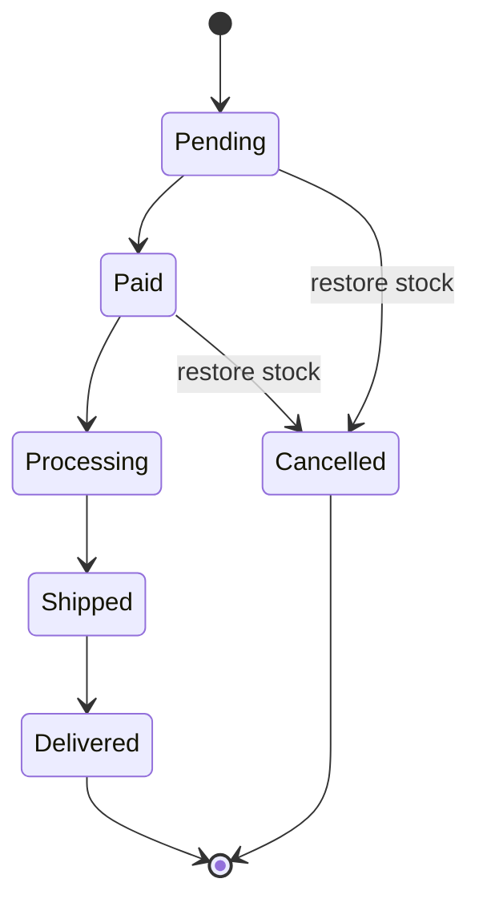

## Phase 5 — Admin order management

Add admin-facing order management on top of the existing `OrderService`. Admin pages under [Components/Admin/Pages/](Components/Admin/Pages/) automatically inherit `AdminLayout` + `[Authorize(Roles = IdentitySeedData.AdminRole)]` from [Components/Admin/Pages/_Imports.razor](Components/Admin/Pages/_Imports.razor), and the `/admin/orders` nav link already exists in [AdminNavMenu.razor](Components/Admin/Layout/AdminNavMenu.razor).

Decisions (confirmed): include a full status-change **history** table + **internal notes** (new entity + migration); allow **cancel only from `Pending` or `Paid`** per SRS 6.3.

### Status workflow + audit

Every status change and every note is written as an `OrderEvent` row (who/when/from/to/message) for the audit timeline.

## 5.0 Schema — `OrderEvent` entity + migration

- New enum [Data/Entities/OrderEventType.cs](Data/Entities/OrderEventType.cs): `StatusChanged`, `NoteAdded`.
- New entity [Data/Entities/OrderEvent.cs](Data/Entities/OrderEvent.cs): `Id`, `OrderId`, `Type`, `OldStatus` (`OrderStatus?`), `NewStatus` (`OrderStatus?`), `Message` (`string?`), `CreatedByUserId` (string), `CreatedAt`, `Order` nav.
- Add `public ICollection<OrderEvent> Events { get; set; } = [];` to [Data/Entities/Order.cs](Data/Entities/Order.cs).
- In [Data/ApplicationDbContext.cs](Data/ApplicationDbContext.cs): `DbSet<OrderEvent>`, mirror existing Fluent config (enum→string via `HasConversion<string>()` with max length, `Message` max length e.g. 1000, index on `OrderId`, `OnDelete(Cascade)` from `Order`).
- Migration: `dotnet ef migrations add AddOrderEvents` (goes into [Migrations/](Migrations/), same namespace as `AddOrdersAndPayments`).

## 5.1 Status rules — `Services/Orders/OrderStatusRules.cs`

Static helper reused by service (validation) and UI (rendering controls):
- `IReadOnlyList<OrderStatus> AllowedNext(OrderStatus current)` → `Pending:[Paid]`, `Paid:[Processing]`, `Processing:[Shipped]`, `Shipped:[Delivered]`, else `[]`.
- `bool CanCancel(OrderStatus current)` → `current is Pending or Paid`.

## 5.2 Admin DTOs — `Services/Orders/Models/`

- `AdminOrderQuery.cs`: `OrderStatus? Status`, `string? Search`, `DateTime? FromDate`, `DateTime? ToDate`, `int Page = 1`, `int PageSize = 10`.
- `AdminOrderListItemDto.cs`: `Id`, `OrderNumber`, `CreatedAt`, `CustomerName`, `CustomerEmail`, `Status`, `PaymentMethod`, `PaymentStatus`, `Total`, `ItemCount`.
- `AdminOrderDetailDto.cs`: order fields (reuse shape of [OrderDto.cs](Services/Orders/Models/OrderDto.cs)) + `Id`, `UpdatedAt`, `CustomerName`, `CustomerEmail`, `IReadOnlyList<OrderLineDto> Items`, `IReadOnlyList<PaymentDto> Payments`, `IReadOnlyList<OrderEventDto> Events`.
- `PaymentDto.cs`: `Method`, `Status`, `Amount`, `Currency`, `GatewayTransactionRef`, `CreatedAt`, `CompletedAt`.
- `OrderEventDto.cs`: `Type`, `OldStatus`, `NewStatus`, `Message`, `CreatedAt`, `CreatedByUserId`.

## 5.3 Service — [IOrderService.cs](Services/Orders/IOrderService.cs) + [OrderService.cs](Services/Orders/OrderService.cs)

Add admin methods (customer joins via subquery on `context.Users` since `Order.UserId` is a plain string):
- `Task<PagedResult<AdminOrderListItemDto>> GetPagedAsync(AdminOrderQuery query, CancellationToken ct = default)` — `AsNoTracking`; filter by `Status`, `CreatedAt >= FromDate`, `CreatedAt < ToDate.AddDays(1)`, and `Search` (order number / customer name / email); order by `CreatedAt` desc; `Skip/Take`.
- `Task<AdminOrderDetailDto?> GetByNumberAsync(string orderNumber, CancellationToken ct = default)` — include `Items`, `Payments`, `Events`; no user scoping (admin).
- `Task<ServiceResult<OrderDto>> UpdateStatusAsync(int orderId, OrderStatus next, string adminUserId, string? note, CancellationToken ct = default)` — load tracked order; reject if `next` not in `OrderStatusRules.AllowedNext(order.Status)` (Cancel goes through `CancelAsync`); set status + `UpdatedAt`; append `OrderEvent(StatusChanged, old, next, note, adminUserId)`; save; return `MapOrder`.
- `Task<ServiceResult<OrderDto>> CancelAsync(int orderId, string adminUserId, string? reason, CancellationToken ct = default)` — in a transaction: load order+items; if `!CanCancel` or already `Cancelled` → `Fail` (idempotency guard prevents double stock restore); for each `OrderItem`, `ExecuteUpdateAsync` add `Quantity` back to `ProductVariant.StockQuantity`; set `Status = Cancelled`; if `PaymentStatus == Pending` set `Failed` (leave `Completed` PayPal alone — online refunds out of scope); append `OrderEvent`; save; commit.
- `Task<ServiceResult<bool>> AddNoteAsync(int orderId, string adminUserId, string note, CancellationToken ct = default)` — append `OrderEvent(NoteAdded, message=note)`; save.

`OrderService` DI is unchanged (already registered in [Program.cs](Program.cs)).

## 5.4 Admin pages — `Components/Admin/Pages/Orders/`

- `Index.razor` (`@page "/admin/orders"`, `@rendermode InteractiveServer`): mirror [Products/Index.razor](Components/Admin/Pages/Products/Index.razor). Toolbar: status `<select>` (All + each `OrderStatus`), From/To date inputs, debounced search box. Table columns: Order #, Customer, Date, Items, Total (`MoneyFormatter.Format`), Payment, Status badge (reuse `StatusClass` styles from customer [Orders/Detail.razor](Components/Pages/Orders/Detail.razor)), row links to `/admin/orders/{OrderNumber}`. Paging via `query.Page` + `PagedResult.TotalPages`. Wrap in `CascadingValue Name="AdminPageTitle"`.
- `Detail.razor` (`@page "/admin/orders/{OrderNumber}"`, `@rendermode InteractiveServer`): load via `GetByNumberAsync`. Show customer + shipping, items, payment(s), totals, and an **events timeline**. Controls: status `<select>` populated from `OrderStatusRules.AllowedNext(order.Status)` + optional note → `UpdateStatusAsync`; **Cancel** button shown when `OrderStatusRules.CanCancel` (confirm prompt) → `CancelAsync`; **Add note** box → `AddNoteAsync`. Resolve admin id via `AuthenticationStateProvider` (`ClaimTypes.NameIdentifier`). Feedback via `AdminToast`; reload after each action.
- Point the dashboard "View all orders" link to `/admin/orders` in [DashboardRecentOrders.razor](Components/Admin/Shared/DashboardRecentOrders.razor) (currently `#`).

## 5.5 Tests — `Nexus.Test.Integration/Features/Orders/`

Extend [DbHelper.cs](Nexus.Test.Integration/Infrastructure/DbHelper.cs): `GetOrderEventsAsync(orderId)`, `GetOrderByIdAsync(orderId)`, a `SetOrderStatusAsync(orderId, status)` helper for arranging states.

- `AdminOrderServiceTests.cs`: paged filter by status; filter by date range; search by order number/customer; `UpdateStatusAsync` valid (Pending→Paid) writes a `StatusChanged` event; invalid transition (Pending→Shipped) rejected; `CancelAsync` from Pending sets `Cancelled` + restores stock **exactly once** + writes event; cancel on already-`Cancelled` fails (no double restore); cancel from `Shipped` rejected; `AddNoteAsync` writes a `NoteAdded` event.
- `AdminOrderPageTests.cs`: `GET /admin/orders` as Admin (default test identity) → 200; as `Customer` role → redirect/forbidden; `GET /admin/orders/{orderNumber}` as Admin → contains order number. Follow the header/role pattern in [OrderPageTests.cs](Nexus.Test.Integration/Features/Orders/OrderPageTests.cs).

## 5.6 Verify

- Stop the dev server (releases `Nexus.exe`), `dotnet build Nexus.csproj` clean.
- Apply migration to dev DB: `dotnet ef database update` (tests migrate via `TestDatabaseFixture`).
- `dotnet test --filter FullyQualifiedName~AdminOrder`, then the full suite (currently 107/107) for no regressions.
- Tick Phase 5 acceptance criteria + milestone checklist in [docs/order-payment-roadmap.md](docs/order-payment-roadmap.md).

## Decisions (chosen; low-risk)

- Unified `OrderEvent` table stores both status changes and notes (one migration, one timeline).
- Admin detail routes by `OrderNumber` (consistent with customer side); mutations take `orderId` from the loaded DTO.
- COD "settlement" stays out of status flow; admin advances `Pending→Paid` manually per SRS. Online refunds remain out of scope — cancelling a `Paid` PayPal order restores stock but does not refund.

## Out of scope

Refunds/webhooks, customer-initiated cancellation, order editing, CSV export, email notifications.